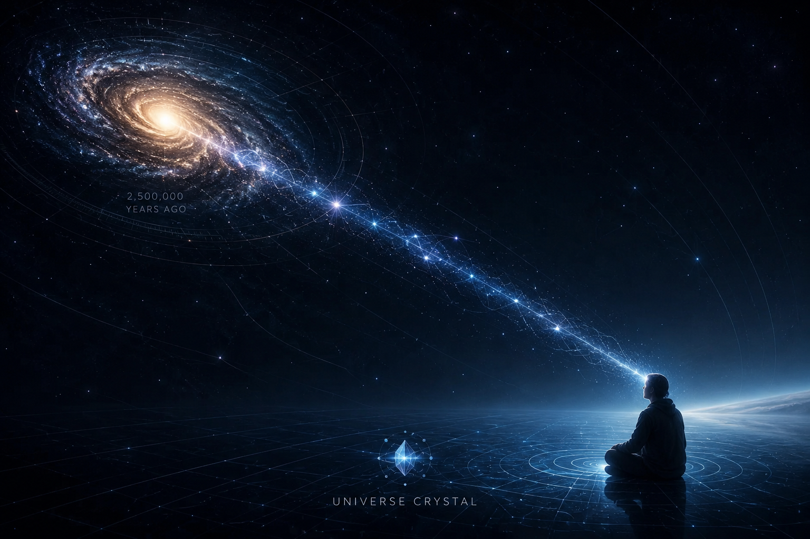

[🏠 Home](../../index.md) | [← Discovery Series](../../series.md)

# Why I Started the Universe Crystal Research Project?

*Universe Crystal Discovery Series — Part 1*

For many years, I have been fascinated by a simple but persistent question:

> **What is the most fundamental structure of reality?**

This question has inspired philosophers, mathematicians, and physicists for centuries. Countless theories have attempted to explain the nature of existence, matter, space, time, information, and consciousness. Rather than trying to replace these perspectives, I found myself wondering whether there might be another way to organize our understanding of reality from the ground up.

That curiosity eventually became **Universe Crystal**.

Universe Crystal is an independent, long-term philosophical research project. It is not a physical theory, nor is it an attempt to replace established scientific models. Instead, it explores ontology—the study of what reality is fundamentally made of and how its most basic structures relate to one another.

What makes this project different is not a claim of having final answers, but the way the research is conducted.

From the beginning, I wanted the project to evolve in a disciplined and transparent manner. Instead of collecting isolated ideas, I chose to build a structured research framework with clearly defined terminology, stable definitions, versioned baselines, and documented revisions. Every important concept can evolve over time while preserving the history of how the framework itself has developed.

In this sense, Universe Crystal approaches philosophical research much like an open engineering project: ideas are organized, definitions are explicit, revisions are recorded, and progress is incremental rather than absolute.

The project is currently organized around several foundational components:

- **Canonical Baseline** — The current stable foundation of the framework.
- **Official Terminology** — Standardized terminology used consistently throughout the project.
- **Official Glossary** — Authoritative definitions of the project's core concepts.
- **Research Reports** — Structured studies exploring specific topics and questions.
- **Research Notes** — Ongoing investigations that may contribute to future baselines.

Together, these components form a living research notebook that emphasizes clarity, consistency, and continuous refinement.

The questions explored by Universe Crystal include:

- What is the most fundamental ontological structure of reality?
- How should events, relations, geometry, and identity be understood?
- Can a coherent philosophical framework emerge from clearly defined first principles?
- How can foundational concepts evolve without sacrificing internal consistency?

I do not expect this project to provide definitive answers to these questions. Some ideas will undoubtedly change. Others may eventually be replaced. That is not a weakness—it is an essential part of genuine research.

The objective is not to defend a fixed doctrine.

The objective is to build a framework that is internally consistent, openly documented, and continuously improved as understanding evolves.

If you are interested in ontology, first principles, conceptual frameworks, or the foundations of reality, I hope you will find something valuable in this journey.

This is only the beginning.

Welcome to the Universe Crystal Research Project.

---

## Discussion

This article is officially published on the Universe Crystal website.

An earlier version was first published on Medium to invite public discussion during the development of the project.

Comments, questions, and constructive feedback are welcome.

**Read and comment on Medium:**

[Why I Started the Universe Crystal Research Project](https://medium.com/@jerry.jiangheng/why-i-started-the-universe-crystal-research-project-576e3dd2b020?sharedUserId=jerry.jiangheng)

---

[Discovery Series](../../series.md) | [Part 2 →](part-02.md)

---

© 2026–Present Heng Jiang · Universe Crystal
