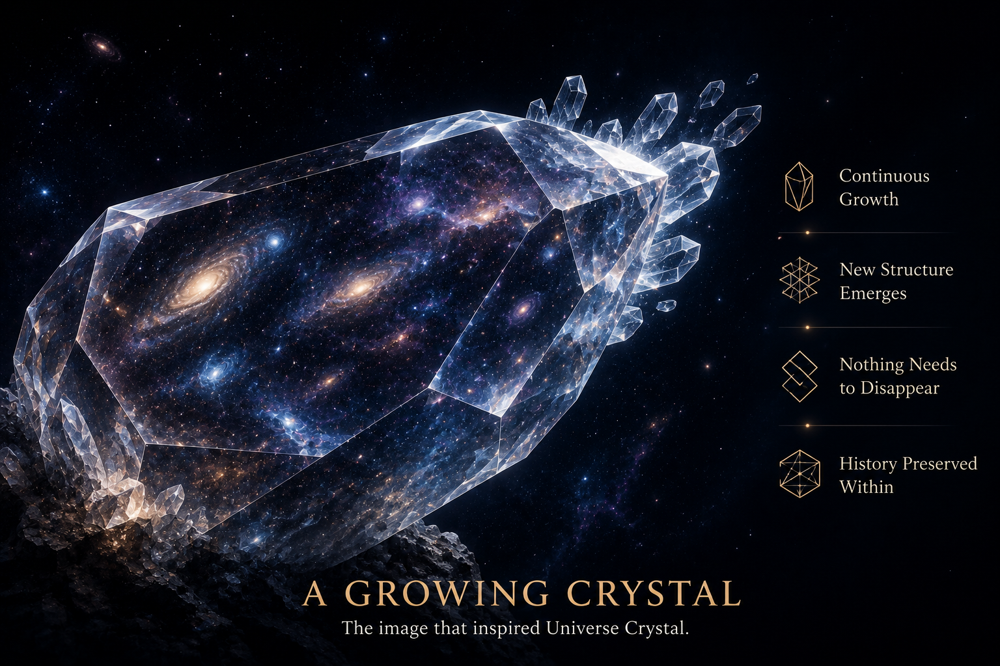

[🏠 Home](../../index.md) | [← Discovery Series](../../series.md)

# Why Study the Evolving Universe as a Whole?

*Universe Crystal Discovery Series — Part 2*

Every piece of research begins with an idea.

Some ideas disappear within minutes.

Others stay with us for years.

This research began with the second kind.

When I was young, I often read sentences like this:

> *The light we see today from a distant galaxy left it millions of years ago.*

Years later, the Hubble Space Telescope extended our view even further into cosmic history.

Today, the James Webb Space Telescope allows us to observe light that began its journey not long after the birth of the universe.

These are among the greatest achievements of modern astronomy. They have profoundly changed our understanding of how the universe has evolved.

Yet every time I came across discoveries like these, the same question quietly returned.

> **If light emitted millions or even billions of years ago can still reach us today, where has the past of the universe gone?**

It clearly has not disappeared.

Otherwise, how could we still observe it?

The question never seemed to leave me.

Over time, I realized that what fascinated me was slightly different from the questions I usually encountered.

Modern physics has achieved extraordinary success in explaining the laws that govern the universe and how it evolves.

But another question gradually began to take shape in my mind.

> **What if the entire evolving universe were itself the object of study?**

Not yesterday's universe.

Not today's universe.

Not tomorrow's universe.

But the entire history of the universe—from its beginning, through the present, and into the future—considered as one continuously evolving whole.

If that entire history is itself a complete object, how should we understand it?

Once that idea appeared, it kept returning.

Whenever I read about distant galaxies.

Whenever JWST released another image from the early universe.

Whenever I thought about the oldest light we can still observe.

The same question came back.

Perhaps what I truly wanted to understand was not simply how the universe evolves.

Perhaps I wanted to understand the evolving universe itself.

But that immediately raised another challenge.

**How do we think about something as vast as the entire evolving universe?**

It was simply too abstract.

I needed a way to hold it in my mind as a single object.

Gradually, one image kept returning.

A growing crystal.

Not because I believe the universe is literally a crystal.

But because a crystal has a remarkable property.

It grows continuously.

New structure emerges.

Nothing that has already formed needs to disappear.

Its entire history remains embedded within its own structure.

Suddenly, I realized that this image gave me a natural way to think about the evolving universe as a whole.

For the first time, I could imagine the entire history of the universe—not as isolated moments, but as one continuously growing whole.

Eventually, that image gave this research its name:

**Universe Crystal.**

Universe Crystal did not begin as a new physical theory.

It began with a question that refused to disappear.

> **If the past of the universe has never truly vanished, should we study the evolving universe as a whole?**

Everything that followed—the concepts, the language, and eventually the philosophical framework of Universe Crystal—grew from that single question.

I am still exploring where that question may ultimately lead.

---

## Discussion

This article is officially published on the Universe Crystal website.

An earlier version was first published on Medium, where readers are welcome to join the discussion.

**→ [Read and comment on Medium](https://medium.com/@jerry.jiangheng/why-study-the-evolving-universe-as-a-whole-b7a07c5a5c65)**

---

[← Part 1](part-01.md) | [Discovery Series](../../series.md) | [Part 3 →](part-03.md)

---
