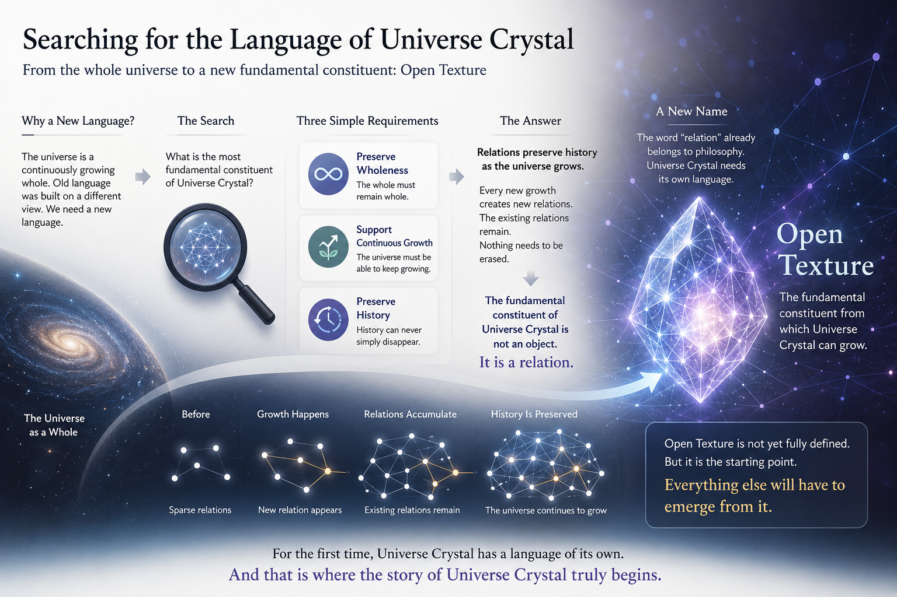

[🏠 Home](../../index.md) | [← Discovery Series](../../series.md)

# Searching for the Language of Universe Crystal

*Universe Crystal Discovery Series — Part 3*

In my previous article, I explained why I chose to study the universe as a whole.

Instead of beginning with particles or local objects, I decided to treat the entire universe as a continuously growing whole.

Once that decision was made, another question appeared almost immediately.

If this was the universe I wanted to describe, I could no longer use the language that had been built upon a different view of the universe.

I needed a new language.

Not because modern physics was wrong.

Not because I wanted to invent new terminology.

But because the background had changed.

Universe Crystal had become the canvas of the entire theory.

Everything that would eventually exist in this universe should emerge naturally from that canvas.

That meant I could not simply begin with concepts such as particles, atoms, molecules, energy, or force.

Those concepts already belonged to later stages of explanation.

My starting point had to be something more fundamental.

## Looking for the Fundamental Constituent

Very quickly, I realized that the question I needed to answer was actually quite simple.

**What is the most fundamental constituent of Universe Crystal?**

If Universe Crystal was the foundation of the entire theory, then it had to possess its own fundamental constituent.

Everything else should eventually emerge from it.

So I was no longer searching for the smallest object in the universe.

I was searching for the most fundamental constituent of Universe Crystal itself.

## Three Simple Requirements

Fortunately, the previous article had already provided the criteria.

This constituent had to preserve the wholeness of the universe.

It had to support continuous growth.

It had to preserve history.

History could never simply disappear.

These were not new assumptions.

They were the natural consequences of viewing the universe as a continuously growing whole.

Any candidate that failed even one of these requirements could not become the foundation of Universe Crystal.

## The Answer Began to Appear

Then a conclusion emerged almost naturally.

If history could never disappear, then history had to be preserved.

If history had to be preserved, then something had to preserve it as the universe continued to grow.

An isolated object could not do that.

Objects simply exist.

They do not preserve the history of how the universe has grown.

Relations do.

Every new growth creates new relations.

The existing relations remain.

Nothing needs to be erased.

At that moment, I realized that the fundamental constituent of Universe Crystal should not be an object.

It should be a relation.

Not because relations sounded more philosophical.

But because they naturally satisfied the principles that had already emerged from viewing the universe as a whole.

## A New Name

However, another problem remained.

The word *relation* already carried meanings that belonged to philosophy.

But I was not trying to borrow a philosophical concept.

I was trying to describe the fundamental constituent of Universe Crystal itself.

If Universe Crystal was to become its own theoretical framework, its most fundamental constituent deserved its own language.

So I gave it a new name.

**Open Texture.**

At that time, Open Texture was only a name.

It was not yet a complete definition.

I did not yet know exactly what an Open Texture was.

I only knew that, somehow, it would become the fundamental constituent from which Universe Crystal could grow.

Everything else would have to emerge from it.

For the first time, Universe Crystal had a language of its own.

I called it **Open Texture**.

And that is where the story of Universe Crystal truly begins.

---

## Discussion

This article is officially published on the Universe Crystal website.

An earlier version was first published on Medium, where readers are welcome to join the discussion.

**→ [Read and comment on Medium](https://medium.com/@jerry.jiangheng/universe-crystal-series-part-3-searching-for-the-language-of-universe-crystal-3b8632e8b116)**

---

[← Part 2](part-02.md) | [Discovery Series](../../series.md) | [Part 4 →](part-04.md)

---

© 2026–Present Heng Jiang · Universe Crystal
