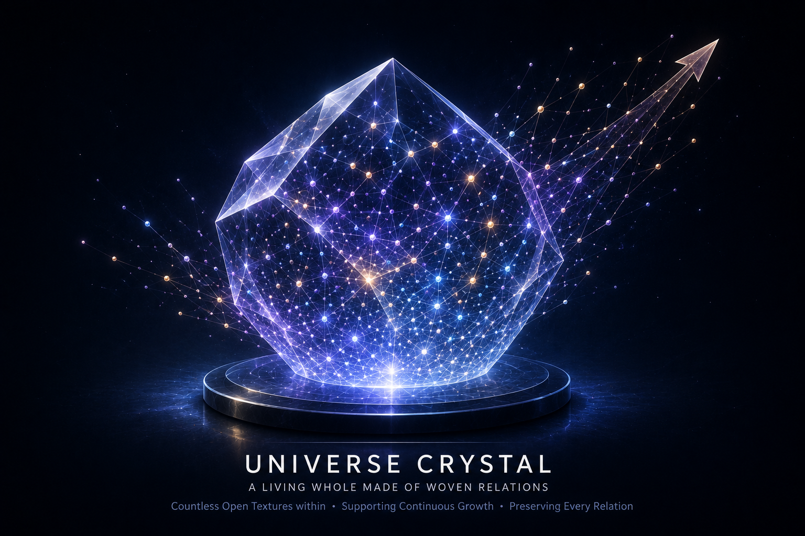

[🏠 Home](../../index.md) | [← Discovery Series](../../series.md)

# Understanding Open Texture

*Universe Crystal Discovery Series — Part 4*

In the previous article, we introduced **Open Texture** as the language needed to describe the universe as a whole.

The next question naturally follows.

**Why can Open Texture become the foundation of the Universe Crystal?**

The answer begins with the requirements of the framework itself.

From the beginning of this research, the search has been guided by four principles.

## Four Principles

A complete description of the universe must preserve **Wholeness**. It must describe the universe as one integrated whole.

It must preserve **Consistency**. The same underlying principle should apply throughout the universe without conflicting with well-established scientific theories.

It must provide a **Framework** capable of supporting every level of organization, from the simplest relations to the universe as a whole.

It must also preserve **Non-removability**. Once a relation becomes part of the universe, it remains part of the universe.

These principles were established before Open Texture was introduced.

As the framework gradually evolved, Open Texture emerged as the only concept capable of satisfying all of them.

Open Texture therefore emerges as the natural foundation of the Universe Crystal.

## The Role of Open Texture

Its role is to carry every relation established throughout the evolution of the universe.

Here, the term **relation** refers to a single relational occurrence rather than a long-term organizational relationship.

Whenever an interaction takes place, it establishes a new relation.

In this sense, every event establishes a relation, and every established relation becomes part of the Open Texture.

The introduction of Open Texture also makes it possible to view the universe from a fundamentally different perspective.

Modern physics has achieved remarkable success in describing the state of the universe at a given moment and explaining how that state evolves through physical laws.

The Universe Crystal framework begins with another question.

**How does the universe, viewed as a whole, preserve every relation established throughout its entire evolution?**

Within this framework, every newly established relation becomes part of the Open Texture.

Open Texture is therefore not simply another concept within the framework.

It provides the foundation that makes this perspective possible.

It enables the universe to be understood not merely as a collection of physical objects or instantaneous states, but as an evolving whole that continuously preserves every relation established throughout its history.

Once the universe is viewed from this perspective, the concept of the **Universe Crystal** is no longer introduced as an assumption.

It emerges naturally as the framework capable of describing the universe as a whole.

## Looking Ahead

Open Texture explains how relations can be preserved throughout the evolution of the universe.

Whether these preserved relations can also be woven into the structure of the universe remains an open question.

The following articles will gradually explore one possible framework for understanding how Open Texture might be woven into increasingly organized structures.

The details of this process remain part of the journey.

---

## Discussion

This article is officially published on the Universe Crystal website.

An earlier version was first published on Medium, where readers are welcome to join the discussion.

**→ [Read and comment on Medium](https://medium.com/@jerry.jiangheng/universe-crystal-series-part-4-understanding-open-texture-10a4fcd6ce16)**

---

[← Part 3](part-03.md) | [Discovery Series](../../series.md) | [Part 5 →](part-05.md)

---

© 2026–Present Heng Jiang · Universe Crystal
