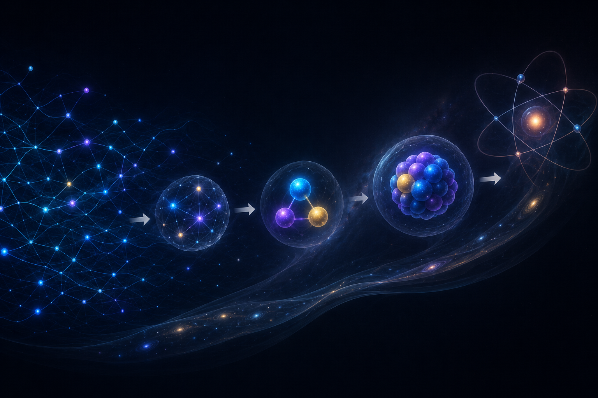

[🏠 Home](../../index.md) | [← Discovery Series](../../series.md)

# How Can the Universe Crystal Be Woven?

*Universe Crystal Discovery Series — Part 5*

### *The Discovery of the Weaving Method*

In the previous article, I arrived at the idea of **Open Texture**.

It answered an important question.

Relations can be preserved.

Every relation that forms has a way to continue existing within the evolving structure of the Universe Crystal.

Soon, another question emerged.

**How can preserved relations evolve into an entire universe?**

The missing piece was no longer the material.

It was the method.

I needed to understand how preserved relations could be woven into stable organizations that could continue to grow and organize the universe.

After exploring many possibilities, one simple idea gradually became clear.

**Closure.**

Closure is the fundamental weaving operation of the Universe Crystal.

It gathers existing relations into a new whole.

What was once a collection of connected Open Textures becomes a stable organization with its own identity.

That organization can then continue to exist within the Universe Crystal as a new organizational unit.

At that moment, I could finally see a path from Open Texture to an evolving universe.

Open Textures preserve relations.

Closures weave stable organizations.

Together, they bring both relations and the physical structures of the universe into the same continuously evolving Universe Crystal.

For the first time, I could see how the Universe Crystal could evolve as a whole.

---

The weaving process begins with what I call a **first-level closure**.

A group of Open Textures forms a stable organization through closure.

Within the Universe Crystal framework, organizations formed through first-level closures correspond to the stable point-like particles described by modern physics.

Once a first-level organization has formed, it becomes a new organizational unit.

New organizational units establish new relations with one another.

As those relations undergo further closures, second-level organizations begin to emerge.

Within the Universe Crystal framework, organizations formed through second-level closures correspond to composite particles.

The proton, for example, can be understood as a stable organization formed through a second-level closure among three quarks.

Each completed organization then becomes a building block for higher levels of organization.

---

The larger picture gradually began to emerge.

I discovered that a first-level closure forms a stable organization.

Once a stable organization has formed, it becomes a new organizational unit capable of establishing new relations.

As these new relations undergo further closures, higher-level organizations begin to emerge.

A continuously growing organizational process starts to unfold within the Universe Crystal.

Looking back, I realized that the earlier articles had been searching for the fundamental material of the Universe Crystal.

This discovery allowed me to see, for the first time, how the Universe Crystal could continue to grow through an ongoing process of organization.

---

This discovery also opened a much deeper set of questions.

If stable organizations are woven through closure, how do different organizations acquire the distinct properties described by modern physics?

How does one organization become an electron, while another becomes a quark?

How do properties such as mass, charge, spin, and other intrinsic characteristics emerge from the weaving process itself?

Beyond the organizations themselves, an even more fundamental question arises.

**How do space and time emerge from this continuously growing structure?**

So far, the concepts of space and time have not yet been introduced into the Universe Crystal.

They are neither the background nor pre-existing assumptions.

Understanding how space and time emerge therefore becomes one of the central questions that the Universe Crystal seeks to answer.

If the Universe Crystal continues to grow through an ongoing process of organization, then the entire physical universe—including the properties of physical organizations, space, and time—must ultimately receive a unified explanation through that same evolutionary process.

I realized that the real journey was only beginning.

In the following articles, I will continue exploring how different patterns of organization give rise to different physical properties, and how space and time themselves gradually emerge as the Universe Crystal continues to grow.

---

## Discussion

This article is officially published on the Universe Crystal website.

An earlier version was first published on Medium, where readers are welcome to join the discussion.

**→ [Read and comment on Medium](https://medium.com/@jerry.jiangheng/part-5-how-can-the-universe-crystal-be-woven-f3b553df5e9e)**

---

[← Part 4](part-04.html) | [Discovery Series](../../series.md) | [Part 6 →](part-06.html)

---

© 2026 Universe Crystal Project
