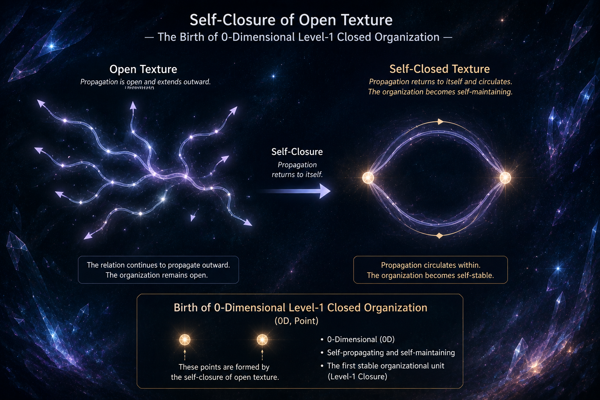

[🏠 Home](../../index.md) | [← Discovery Series](../../series.md)

# How Does an Open Texture Begin Weaving?

*Universe Crystal Discovery Series — Part 6*

## The Discovery of the First Self-Closed Organization

In the previous article, I discovered that **closure** is the fundamental operation through which the Universe Crystal weaves stable organizations.

Open Textures preserve relations.

Closures weave stable organizations.

For the first time, it became possible to see how the Universe Crystal might gradually grow through an ongoing process of organization.

But one question still remained.

**How does an Open Texture actually begin weaving?**

---

Up to this point, the Universe Crystal had only one fundamental organizational concept.

**Open Texture.**

And Open Texture already possessed one essential characteristic.

It carries propagation.

Propagation had become the language through which relations continue to exist and evolve within the Universe Crystal.

Nothing else had yet been introduced.

There was no space.

No time.

No force.

No energy.

No fields.

If weaving truly begins from Open Texture, then it must begin using propagation alone.

---

An Open Texture carries propagation.

Propagation carries relations.

Propagation alone does not preserve an organization.

It only allows relations to continue.

Something else is required before weaving can begin.

---

Gradually, a simple realization emerged.

If an organization is to continue propagating while remaining the same organization, its propagation cannot remain open.

In other words, it must propagate back to itself.

Only then can the organization continuously preserve itself.

The only way this can happen is through **self-closure**.

Once an Open Texture closes upon itself, propagation no longer simply carries relations outward.

Instead, propagation continuously preserves the closed organization itself.

At that moment, everything became clear.

An Open Texture does not begin weaving by extending indefinitely.

It begins weaving by first becoming self-closed.

There was still no space.

Without space, nothing could yet possess spatial extension.

The first self-closed organization was therefore naturally **0-dimensional**.

It was the simplest possible organization capable of preserving itself through self-closure.

---

This discovery also revealed the first self-closed organization within the Universe Crystal.

It was therefore the first **Level-1 organization**.

Closure is not merely a geometric event.

It marks the birth of the first organization capable of continuously preserving itself.

Open Texture propagation carries relations.

Propagation within a self-closed organization continuously preserves the organization itself.

This self-stabilizing propagation continuously maintains the identity of that organization.

Without self-closure, self-stabilizing propagation cannot exist.

---

Looking back at modern physics, this idea appears remarkably consistent with the behavior of stable particles.

Once formed, an electron normally preserves its identity under ordinary physical conditions.

Only under sufficiently extreme conditions can that organization be disrupted or reorganized into something else.

Within the Universe Crystal framework, this stability becomes understandable.

A Level-1 organization is stable because it is self-closed.

Its organization is continuously preserved through self-stabilizing propagation.

Only when the closed organization itself is disrupted can a different organization emerge.

---

Weaving does not begin by creating increasingly larger structures.

It begins when an Open Texture first becomes capable of preserving itself.

The first self-closed organization is therefore not simply another stage of organization.

It is the first organization capable of preserving itself through its own propagation.

It is the moment when weaving truly begins.

---

This discovery naturally leads to another question.

If self-closure marks the beginning of weaving, how does weaving continue?

How do higher levels of organization emerge from the first self-closed organization?

That will become the next step in exploring the Universe Crystal.

---

## Discussion

This article is officially published on the Universe Crystal website.

An earlier version was first published on Medium, where readers are welcome to join the discussion.

**→ [Read and comment on Medium](https://medium.com/)**

---

[← Part 5](part-05.md) | [Discovery Series](../../series.md) | [Part 7 →](part-07.md)

---
