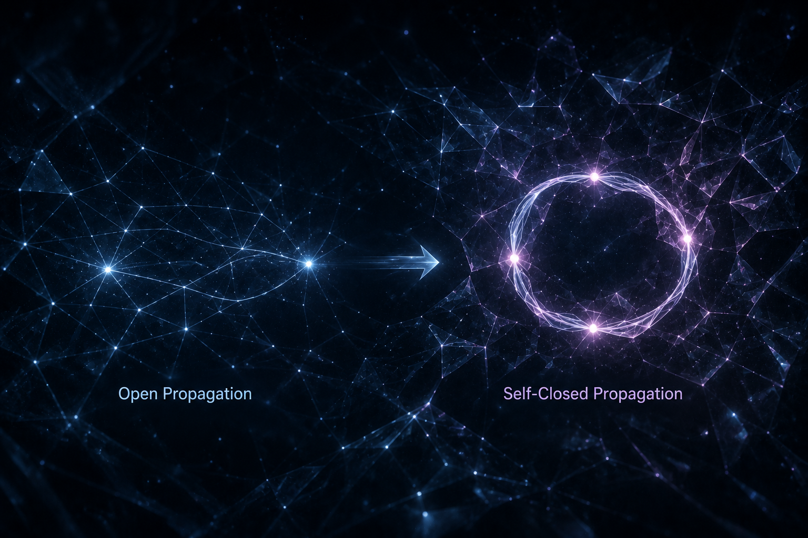

[🏠 Home](../../index.md) | [← Discovery Series](../../series.md)

# Why Does Self-Closed Propagation Become Existence?

*Universe Crystal Discovery Series — Part 7*

## The Discovery of the First Recognizable Existence

In the previous article, we discovered that propagation within the Open Texture can become self-closed.

This discovery naturally leads to a deeper question.

**If a propagation becomes self-closed, why should it become an existence?**

Why is self-closure more than simply another propagation pattern?

This question marks one of the most important turning points in the Universe Crystal project.

For the first time, we are no longer asking how propagation evolves within the Open Texture.

We are asking how the universe first becomes capable of producing existence itself.

---

## Identity Cannot Be Assumed

Identity appears so natural that we seldom question where it comes from.

In everyday life, we recognize people, objects, and particles as possessing their own identities.

Modern physics likewise treats elementary particles as distinguishable entities with intrinsic properties.

But if identity is introduced as a starting assumption, its origin remains unexplained.

Within the Universe Crystal framework, nothing fundamental should be accepted simply because it appears familiar.

Identity should not be assumed.

It should be discovered.

The question therefore becomes:

**Under what conditions can the first recognizable existence appear?**

---

## From Open Propagation to Self-Closure

An open propagation establishes relations throughout the Open Texture, but it remains a complete propagation event.

Once propagation becomes self-closed, it no longer terminates as a complete propagation event.

Instead, the propagation continuously preserves itself through self-closure.

Self-closure therefore no longer represents the completion of a propagation event.

It becomes the means by which the propagation continuously preserves its own existence.

This is the essential transition.

The significance of self-closure is not simply that propagation returns to itself.

Its significance lies in the possibility that propagation can preserve itself continuously.

---

## When Propagation Becomes Existence

At this point, the answer begins to emerge.

Self-closure does not simply produce another propagation pattern.

It produces something fundamentally different from an open propagation.

An open propagation and a self-closed propagation are fundamentally different.

A self-closed propagation continuously preserves itself through self-closure.

Because the propagation continuously preserves itself, the self-closure becomes stable.

For the first time, the universe becomes capable of preserving a stable propagation.

**This is the moment when propagation becomes existence.**

Existence is not introduced from outside.

It is not assigned by definition.

Nor is it assumed as a primitive concept.

It emerges naturally from stable self-closure.

Once a stable existence can preserve itself, it becomes distinguishable from every other stable existence.

Identity is the natural consequence of that transition.

The appearance of identity is therefore not the beginning of the story.

It is the result of the first stable existence.

---

## The First Stable Existence

This discovery also provides a new perspective on one of the most familiar concepts in modern physics.

Modern physics begins with elementary particles.

The Universe Crystal framework begins one step earlier.

Rather than asking how particles behave, it asks how the first recognizable existence becomes possible.

From this perspective, the first stable existences discovered in the Universe Crystal framework correspond to what modern physics recognizes as elementary particles.

This is not intended to replace modern physics.

Instead, it offers a possible explanation for why identifiable particles can exist in the first place.

---

## Looking Ahead

The discovery presented in this article marks the completion of the first stage of the Universe Crystal journey.

For the first time, the universe becomes capable of producing a stable first-level organization.

Yet this is only the beginning.

A universe composed only of first-level organizations could never produce the richness we observe today.

The next question therefore becomes inevitable.

**How can stable first-level organizations be woven into second-level organizations?**

The next stage of the Universe Crystal project begins with that question.

It explores how increasingly higher levels of organization emerge from the first stable existence, gradually giving rise to the rich organizational hierarchy of the universe.

---

## Discussion

This article is officially published on the Universe Crystal website.

An earlier version was first published on Medium, where readers are welcome to join the discussion.

**→ [Read and comment on Medium](https://medium.com/@jerry.jiangheng/universe-crystal-discovery-series-part-7-why-does-self-closed-propagation-become-existence-3d1c18fbc3ad?sharedUserId=jerry.jiangheng)**

---

[← Part 6](part-06.md) | [Discovery Series](../../series.md) | [Part 8 →](part-08.md)

---

© 2026–Present Heng Jiang · Universe Crystal
