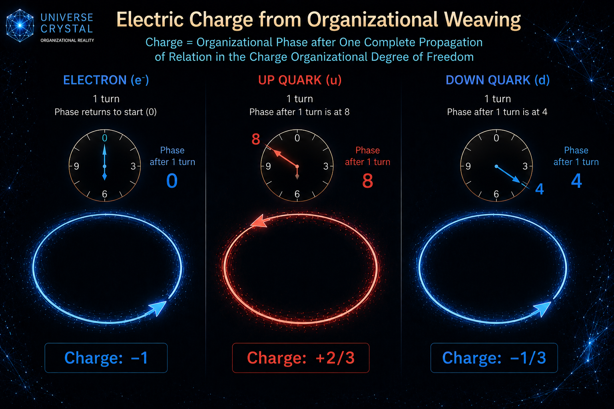

[🏠 Home](../../index.md) | [← Discovery Series](../../series.md)

# ow Does Organizational Weaving Give Rise to Electric Charge?

*Universe Crystal Discovery Series — Part 9*

## An Organizational Interpretation of Electric Charge through Weaving Phase

One of the most fundamental discoveries of modern physics is that every
elementary particle possesses electric charge.

Every electron always carries the same negative charge.

Up and down quarks carry fractional electric charges.

These values have been verified repeatedly by experiment.

Yet a deeper question naturally remains.

**Why do these charge values exist?**

The Standard Model treats electric charge as one of the intrinsic
quantum properties of elementary particles.

The Universe Crystal framework asks a different question.

**What is the organizational origin of electric charge?**

------------------------------------------------------------------------

The Canonical Baseline proposes that electric charge originates from an
Organizational Degree of Freedom.

This immediately leads to another question.

**What distinguishes the Charge Organizational Degree of Freedom from
other Organizational Degrees of Freedom?**

As the research gradually progressed,

I came to realize that the distinguishing feature of the Charge
Organizational Degree of Freedom is not a different organizational
mechanism.

Instead,

**organizational weaving within this Degree of Freedom naturally
possesses a Weaving Phase.**

As Texture continuously propagates through Stable Closure,

its Weaving Phase evolves continuously.

Accordingly,

electric charge may be understood through the Weaving Phase manifested
by organizational weaving.

------------------------------------------------------------------------

Within the Charge Organizational Degree of Freedom,

the Texture continuously forms a First-Level Stable Closed Texture
through organizational weaving.

One complete self-closed propagation constitutes one complete weaving
cycle.

Each weaving cycle naturally manifests a Weaving Phase.

At the present stage,

the direction of the Weaving Phase is assumed to follow the direction of
organizational weaving.

The electric charge of a particle is therefore interpreted as

**the Weaving Phase manifested after one complete weaving cycle of the
Texture.**

------------------------------------------------------------------------

The Texture forming an electron exhibits the simplest organizational
weaving.

After one complete weaving cycle,

its Weaving Phase returns to its original state,

manifesting a complete negative phase.

Its electric charge is therefore **−1**.

The Texture forming a down quark exhibits another form of organizational
weaving.

After one complete weaving cycle,

its Weaving Phase changes by one third of the complete negative phase.

Only after three complete weaving cycles does the Weaving Phase return
to its original state.

Its electric charge therefore becomes **−1/3**.

The Texture forming an up quark exhibits yet another form of
organizational weaving.

Its weaving direction is opposite to that of the electron.

After one complete weaving cycle,

its Weaving Phase changes by two thirds of the complete positive phase.

Only after three complete weaving cycles does the Weaving Phase return
to its original state.

Its electric charge therefore becomes **+2/3**.

From the organizational perspective,

fractional electric charge is no longer an arbitrary numerical
assignment.

It naturally emerges from the Weaving Phase manifested after each
weaving cycle.

------------------------------------------------------------------------

This interpretation also extends naturally to composite particles.

A proton consists of two up quarks and one down quark.

After one weaving cycle of each constituent Texture,

their manifested Weaving Phases are

+2/3

+2/3

−1/3

which together produce an overall electric charge of **+1**.

Likewise,

a neutron consists of one up quark and two down quarks.

Their corresponding Weaving Phases are

+2/3

−1/3

−1/3

which together produce an overall electric charge of **0**.

The electric charge of a composite particle therefore emerges naturally
as the algebraic sum of the Weaving Phases manifested by its constituent
First-Level Stable Closed Textures.

------------------------------------------------------------------------

By introducing the concept of **Weaving Phase**,

the Universe Crystal framework provides a unified organizational
interpretation of the origin of electric charge.

Within this interpretation,

electric charge continues to appear as an intrinsic property of
elementary particles.

From the organizational perspective, however,

it is understood as the Weaving Phase manifested after one complete
weaving cycle of the Texture within the Charge Organizational Degree of
Freedom.

Accordingly,

the electric charges of the electron, the up quark, and the down quark
can all be understood through the same organizational language.

## Discussion

This article is officially published on the Universe Crystal website.

An earlier version was first published on Medium, where readers are welcome to join the discussion.

**→ [Read and comment on Medium](https://medium.com/@jerry.jiangheng/universe-crystal-discovery-series-part-9-how-does-organizational-weaving-give-rise-to-electric-4b7de87768fa)**

---

[← Part 8](part-08.md) | [Discovery Series](../../series.md) | [Part108 →](part-10.md)

---