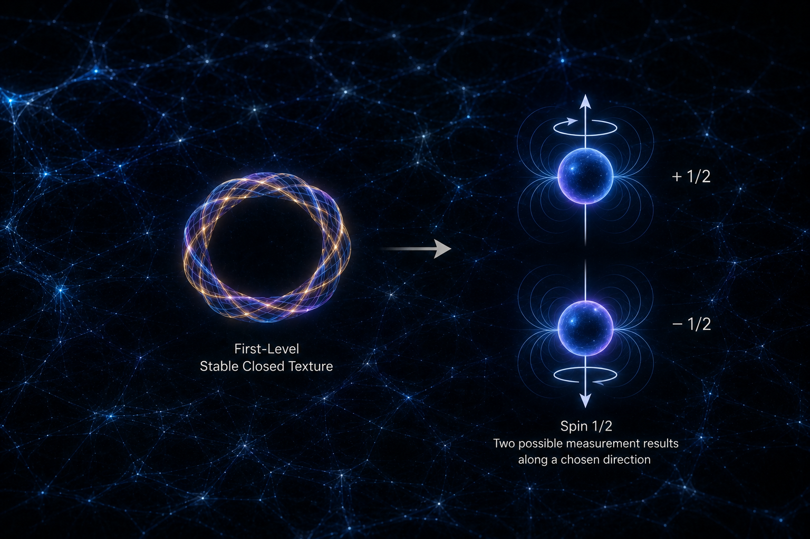

[🏠 Home](../../index.md) | [← Discovery Series](../../series.md)

# What Is Spin in Universe Crystal?

*Universe Crystal Discovery Series — Part 10*

## An Organizational Interpretation of Spin in First-Level Stable Closed Texture

Spin is one of the fundamental properties of elementary particles.

In modern physics, spin is an independent quantum degree of freedom of a
particle.

All known elementary fermions, including electrons, quarks, and
neutrinos, have spin (1/2).

This raises a basic question for Universe Crystal:

**What is spin at the level of organization?**

------------------------------------------------------------------------

Universe Crystal begins with Texture.

Texture continuously propagates in closure and forms Stable Closure.

Stable Closure forms First-Level Stable Closed Texture.

The organization associated with spin is therefore already a stable
closed organization.

This organization exists within spatial freedom and forms Relations with
other organizations through space.

Understanding spin therefore requires us to consider:

**How First-Level Stable Closed Texture is organized within spatial
freedom.**

------------------------------------------------------------------------

Weaving provides a useful way to visualize this.

Imagine Texture as a thread being woven.

In Part 9,

we examined the weaving process itself.

When Texture completes one weaving cycle,

the change in Weaving Phase manifests as electric charge.

Spin concerns another aspect of the organization formed through weaving:

**the organizational configuration formed when Texture becomes
First-Level Stable Closed Texture, and its relation to spatial
freedom.**

Here, "organizational configuration" does not mean that an elementary
particle possesses a directly observable geometric shape.

It refers to the organization established when Texture forms Stable
Closure,

and to the relation between this organization and spatial freedom.

The Dirac belt trick provides a useful analogy.

An organized configuration does not necessarily return to its original
state after one complete rotation.

After a second complete rotation,

it can return to the original state.

The analogy helps us visualize the special phase behavior associated
with spin.

The important point is the change of an organizational state under
spatial rotation.

------------------------------------------------------------------------

This leads to a deeper question:

**Why does a First-Level Stable Closed Texture require such a spatial
organizational property?**

Consider two identical First-Level Stable Closed Textures,

each occupying a different position in space.

Their spatial states,

and their Relations with each other,

are part of their overall organization.

If two identical organizations could be completely exchanged in space

without producing any difference in the overall organizational state,

then their spatial arrangement would have no organizational distinction.

But the formation of higher-level organization requires elementary
organizations to participate in different spatial arrangements.

Therefore,

**the spatial Relations between identical First-Level organizations must
have organizational significance.**

In modern physics,

fermions have a distinctive exchange property.

When two identical fermions are exchanged,

the overall quantum state undergoes a phase reversal rather than
remaining completely unchanged.

This property is associated with fermionic statistics

and provides the basis of the Pauli exclusion principle.

As a result,

electrons cannot occupy exactly the same quantum state without
restriction.

They occupy different quantum states,

allowing different energy levels and electron shells to form,

and allowing electrons to participate in atoms, molecules, and higher
levels of matter organization.

From the perspective of Universe Crystal,

this provides an important clue:

**The spatial organization of First-Level organization is an important
condition for the formation of higher-level organization.**

------------------------------------------------------------------------

This leads to the central question of spin:

**Why is the spin of elementary fermions (1/2)?**

Elementary fermions, including electrons, quarks, and neutrinos,

all have the same spin magnitude.

From an organizational perspective,

this can be understood through a simple principle.

**Minimum Sufficient Organization**

An organization requires only the simplest structure sufficient to
satisfy its organizational requirements.

When a lower level of organizational complexity is already sufficient,

there is no need to introduce a higher level of complexity.

For First-Level Stable Closed Texture,

the organization needs a basic spatial property that allows it to
participate in spatial arrangements, spatial Relations, and exchange.

Spin (1/2) is sufficient for this basic requirement.

Therefore,

there is no need for a basic First-Level organization to adopt higher
half-integer structures such as (3/2) or (5/2).

From this perspective,

**(1/2) is the minimum sufficient spatial organization of basic
fermionic organization.**

This also allows different elementary fermions to differ in other
organizational degrees of freedom

while sharing the same basic spin magnitude.

------------------------------------------------------------------------

Then why do we measure (+`\frac12`{=tex}) and (-`\frac12`{=tex})?

Here we need to distinguish between:

**the organization itself**

and

**the result of an external measurement.**

First-Level Stable Closed Texture does not therefore need to be
understood as having two different internal organizational
configurations.

For the same basic organization,

when spin is measured along a chosen spatial direction,

two opposite spin projection results can be obtained:

\[+1/2\] or \[-1/2\]

The positive and negative results therefore do not represent two
different basic organizations.

They are two opposite observable results obtained when the same basic
organization is measured along a chosen spatial direction.

In other words,

**The First-Level organization has a unified basic organizational
structure, while (+1/2) and (-1/2) are two observable manifestations of
that organization under a specific spatial measurement.**

------------------------------------------------------------------------

This also clarifies the distinction between charge and spin.

In Part 9,

we examined:

**change in Weaving Phase during the weaving process → charge.**

In Part 10,

we examine:

**the relation between the organization formed through weaving and
spatial freedom → spin.**

Charge asks:

**How much does the Weaving Phase change during one weaving cycle?**

Spin asks:

**What spatial organizational property does the First-Level organization
possess?**

They therefore correspond to different organizational degrees of
freedom.

------------------------------------------------------------------------

Spin is an independent quantum degree of freedom of an elementary
particle.

Universe Crystal approaches this degree of freedom from the perspective
of organization.

After Texture forms First-Level Stable Closed Texture,

the organization exists within spatial freedom

and exhibits spin as an independent quantum property.

For elementary fermions,

this spin is (1/2).

When measured along a particular spatial direction,

it can produce (+1/2) or (-1/2).

In Universe Crystal's organizational language,

(1/2) can therefore be understood as the:

**minimum sufficient spatial organization of First-Level organization.**

## Discussion

This article is officially published on the Universe Crystal website.

An earlier version was first published on Medium, where readers are welcome to join the discussion.

**→ [Read and comment on Medium](https://medium.com/@jerry.jiangheng/universe-crystal-discovery-series-part-10-what-is-spin-in-universe-crystal-fd0fc86df57f)**

---

[← Part 9](part-09.md) | [Discovery Series](../../series.md)

---