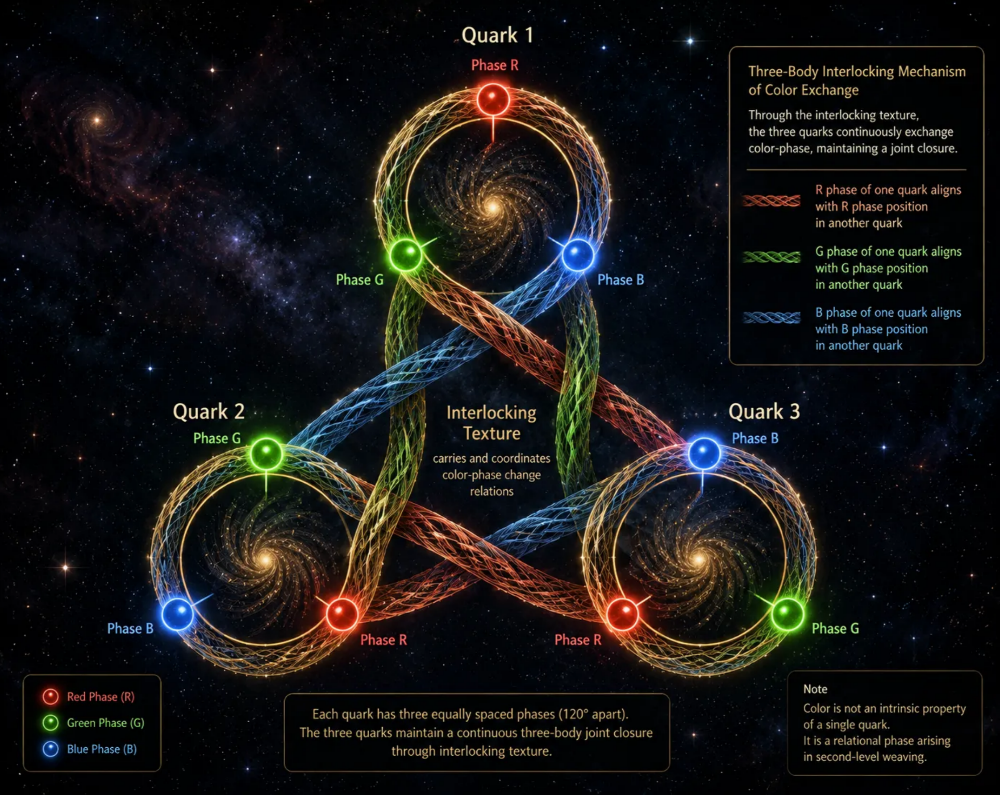

[🏠 Home](../../index.md) | [← Discovery Series](../../series.md)

# How Do Three Quarks Weave a Proton or Neutron??

*Universe Crystal Discovery Series — Part 11*

## The Beautiful Emergence of a Two-Layer Color Closure

At first, we simply wanted to understand a very basic question:

**How can three First-Level Organizations form a Second-Level Organization?**

The three quarks already exist as First-Level Organizations, each with its own closure.

If an existing closure is the basis of an organization’s stable existence, then these three organizations cannot simply combine their existing closures and thereby become a new organization.

A Second-Level Organization must have its own closure.

But the three First-Level Organizations cannot move directly from their existing closures to one collective closure.

They must first establish new organization among themselves.

This leads to a simple but important logical consequence:

**The formation of a Second-Level Organization requires two levels of closure.**

First, the three already-closed First-Level Organizations form their own closures in a new organizational degree of freedom.

Then, those three new closures form another collective closure.

In its most abstract form:

**Three First-Level Organizations**

→ **Three new local closures**

→ **A collective closure of the three local closures**

→ **Second-Level Organization**

At this point, we did not yet know what the new organizational degree of freedom was.

The structure was purely abstract.

What appeared in the mind was simply:

**three nested closed loops.**

Three existing organizations.

Three new closures.

And then one closure around the three.

It was a beautiful but highly abstract structure.

Then color charge entered the picture.

And suddenly, something beautiful appeared.

The color relation among the three quarks has a phase cycle:

**Red → Green → Blue → Red.**

The first abstract closure suddenly acquired a concrete form: a **color-phase cycle**.

The three quarks participate in this cycle through their respective color phases, forming a closed relational pattern.

But the story does not end there.

These three local color closures themselves form a higher-order organization.

Their relations must also close collectively.

The same principle of color-phase closure therefore appears again at the next organizational level.

A two-layer structure emerges:

**First layer: three local closures in color-phase space**

**Second layer: a collective color-phase closure of those three local closures**

This was the beautiful moment.

The three abstract nested loops suddenly had color.

They had phase.

They had circulation.

And, most importantly, they had a structure that could be visualized.

The three quarks were no longer simply three points connected by an interaction.

Their color relations could be understood as an **Interlocking Texture**.

The first layer of color closure belongs to the local organization.

The second layer emerges from the mutual weaving of those local closures.

The two layers interlock.

And through that interlocking, the three First-Level Organizations form a new whole.

This gives a much more concrete picture of how a proton or neutron could emerge as a Second-Level Organization:

**three already-closed organizations**

→ **new color-phase closures**

→ **interlocking of those closures**

→ **a higher-order color closure**

→ **a three-dimensional topological organization.**

The striking part is that the higher-order structure does not have to be added from outside.

The three quarks retain their own existing organization.

Their relations become the texture of the next level.

That texture interlocks.

The interlocking creates another closure.

And that closure gives rise to a new organization.

So the original organizational deduction —

**closure, followed by closure of closures** —

has finally acquired a concrete picture:

**three quarks, woven through two layers of color closure, forming one higher-order topological structure.**

What began as three abstract nested loops has now become a picture of how three quarks may weave a proton or neutron.

**The abstract structure has finally become visible.**

This is the beauty of Interlocking Texture.

**→ [Read and comment on Medium](https://medium.com/@jerry.jiangheng/universe-crystal-discovery-011-how-do-three-quarks-weave-a-proton-or-neutron-1c194f32db25?sharedUserId=jerry.jiangheng)**

---

[← Part 10](part-10.md) | [Discovery Series](../../series.md) | [Part 12 →](part-12.md)

---
