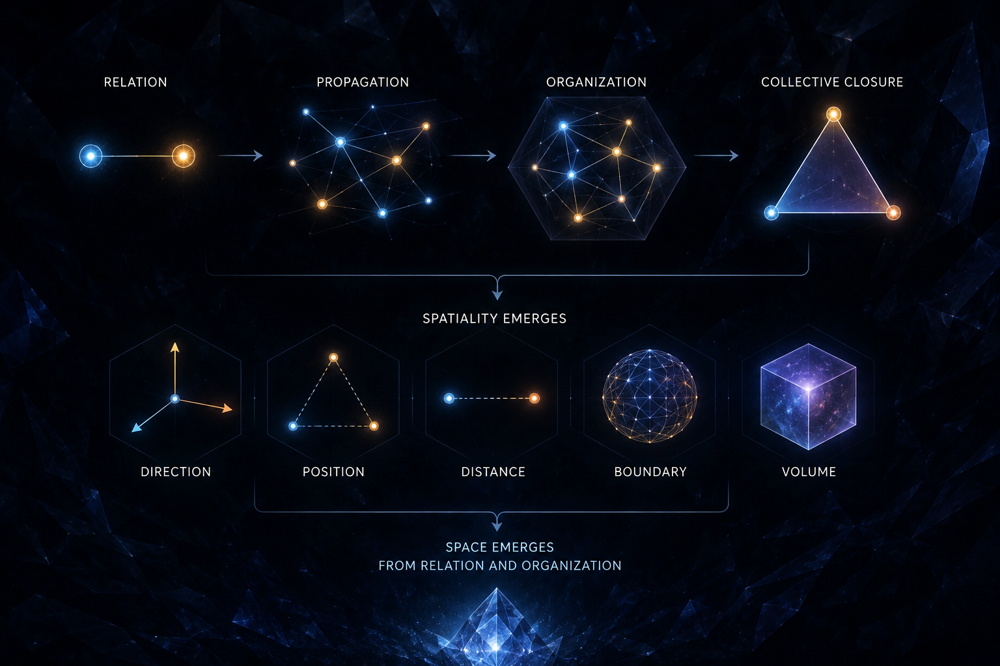

[🏠 Home](../../index.md) | [← Discovery Series](../../series.md)

# The Emergence of Space from Relation and Organization

*Universe Crystal Discovery Series — Part 12*

We usually think of space as something that already exists.

Then things appear inside it.

Particles have positions. Objects have sizes. Things have distances from
one another. They can move up, down, left, right, forward, and backward.

Space seems to be a container that was already there.

But Universe Crystal begins with a different idea:

> **Space may not be fundamental.**
>
> **Space may emerge from relations and organization.**

------------------------------------------------------------------------

## What Is Space Without Relation?

Imagine that there is only one isolated thing in the universe.

Nothing else exists.

There is no relation.

Can we still say that it is:

above something?

below something?

to the left?

to the right?

far from something?

near something?

Where is it?

These questions lose their meaning.

Because "left" and "right" require something to relate to.

"Near" and "far" require comparison.

"Position" requires relation.

"Direction" requires relation.

Even "distance" is a relation between two things.

So many of the basic properties we normally associate with space already
depend on relation.

This leads to a simple question:

> **If the basic properties of space are themselves relations, does
> space really have to exist before relation?**

Perhaps not.

------------------------------------------------------------------------

## Starting with Open Relations

Universe Crystal begins with **Relation**.

Relation can propagate.

One organization can form a relation with another.

More relations can form an open texture.

As these relations propagate, we can begin to describe:

**direction.**

**position.**

**near and far.**

**distance.**

We did not first create a space and then place these relations inside
it.

Instead:

> **The existence of relations makes these spatial concepts possible.**

Space begins to appear through them.

------------------------------------------------------------------------

## But Where Does Volume Come From?

There is another important property of space.

An object does not only have a position or a distance from something
else.

It also has:

**size.**

It occupies:

**volume.**

Where does this spatial extension come from?

Universe Crystal suggests that this may involve another kind of
relation.

Not simply an open relation between one organization and another,

but:

> **relations within the organization itself.**

When relations inside an organization form **collective closure**, the
organization begins to develop its own structure.

We can then distinguish:

**interior**

**boundary**

**exterior**

The organization is no longer simply "located in space."

It begins to have a spatial structure of its own.

It can have:

**shape.**

**extension.**

**volume.**

So spatial properties may arise through two different ways of organizing
relation:

**open relations**

and

**closed relations within an organization.**

------------------------------------------------------------------------

## Space May Not Be a Thing

At this point, another possibility appears.

We normally say:

> "Space exists."

But perhaps space is not an independent thing.

Perhaps what we call space is the overall manifestation of many
different relations and organizations.

For example:

**up, down, left, right, forward, backward**

come from directional relations.

**position, near and far, distance**

come from relations between organizations.

**interior, boundary, exterior**

come from the closure of an organization.

**shape and volume**

come from the spatial structure of an organization itself.

In other words:

> **We may think we are describing space, while we are actually
> describing relations and organizations.**

------------------------------------------------------------------------

## Then Why Three Dimensions?

This leads to a deeper question:

**Why is space three-dimensional?**

Universe Crystal has found that three organizations can form the
simplest collective closure:

**A → B → C → A**

Two organizations can form a relation.

But three organizations can form the simplest closed structure.

This gives three a special organizational significance.

It therefore raises a natural question:

> **Could three-dimensional space be related to this three-part
> collective closure?**

This remains a structural hypothesis under investigation.

We have not yet developed it into a complete mathematical proof.

But it offers a direction worth exploring:

**Perhaps three-dimensional space was not simply given.**

**Perhaps it is related to the way organization forms collective
closure.**

------------------------------------------------------------------------

## Where Does Space Begin?

For now, we can summarize this exploration with a simple picture:

**Relation**

↓

**Propagation**

↓

**Organization**

↓

**Collective Closure**

↓

**Spatiality**

We do not begin with an already existing space.

We begin with relation.

Relation propagates through open texture and creates spatial relations
between organizations.

Relation can also form closure within an organization, allowing the
organization itself to develop spatial structure.

Eventually, properties such as:

**position, direction, distance, interior, boundary, shape, and volume**

begin to appear.

How these spatial relations may further give rise to geometry, metric,
and a complete structure of space is a question for the next stage of
the investigation.

For now, Universe Crystal proposes something more fundamental:

> **Space may not be the container in which the universe exists.**

> **Space may be what emerges when Relation becomes organized.**

**→ [Read and comment on Medium](https://medium.com/@jerry.jiangheng/universe-crystal-discovery-012-the-emergence-of-space-from-relation-and-organization-f68ec2733357)**

---

[← Part 11](part-11.md) | [Discovery Series](../../series.md)

---