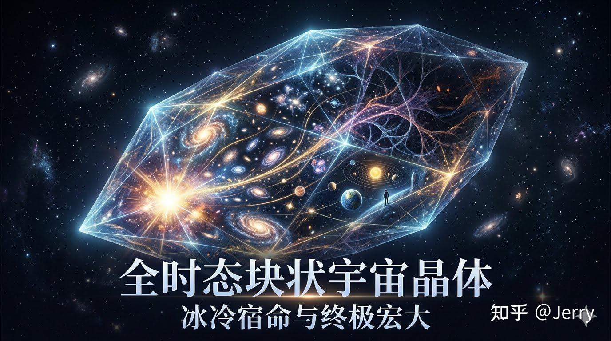

[🏠 Home](../../index.md) | [← Universe Crystal Essays](index.md)

# Universe Crystal Essay 000

## The Prequel

*Before Canonical*

On **27 June 2026**, I published a science-philosophy essay on Zhihu titled:

> **The Universe Is a Timeless Crystal: A Projection of the Entire History from the Big Bang to Heat Death**

Original article:

https://zhuanlan.zhihu.com/p/2054344687926900598

This essay was written before the Universe Crystal Project formally existed.

At the time, there was no Canonical Baseline, no Research Report, no Official Glossary, no Framework, Ontology, or Epistemology, and no long-term research program.

For this reason, I have preserved it as **Universe Crystal Essays 000**.

It belongs to the **Before Canonical** period—the stage before the scientific-philosophical foundation of the Universe Crystal Project was established.

It is numbered **000** not because it was my first publication, but because it was the first attempt to describe the evolving universe as a whole through a Grand View. In many ways, it represents the true beginning of the Universe Crystal Project.

---

# A Grand View Thought Experiment

When I wrote this essay, I was not trying to construct a new theory.

I simply wanted to explore one question:

> **What would we see if we could observe the entire universe from a Grand View?**

To explore this idea, I imagined a traveler.

The traveler existed outside the universe being observed and was able to view the entire evolving universe as a whole.

However, one strict rule was imposed from the beginning.

The traveler could observe, but could never participate.

The traveler could not influence any event within the universe, nor become an observer inside it.

This constraint was introduced to avoid the observer effect and to preserve the universe as a complete and self-consistent whole.

From this perspective, the universe appeared in a way completely different from our ordinary experience.

---

# What the Traveler Saw

The traveler did not see a universe evolving moment by moment.

Instead, the traveler saw the entire history of the universe—from the Big Bang to the distant heat death—existing together as one complete whole.

For observers living inside the universe, these events are separated by billions of years.

For the traveler, they were simply different regions of the same cosmic structure.

The traveler saw a universe without a true boundary.

Without an outside.

Without a center.

There was no larger space surrounding the universe, and no external position from which the universe itself could be placed or measured.

The universe was simply the whole of existence.

The traveler also saw that the substance of the universe was neither matter, nor energy, nor empty space.

Its true substance was relations—the causal network connecting every event throughout cosmic history.

The universe itself was the woven whole of these relations.

The traveler saw that space was not an independent container.

Instead, space was only a local cross-section obtained by slicing through the complete Universe Crystal.

Different slices produced different spatial views.

Space belonged to the observer's perspective rather than to the Universe Crystal itself.

The traveler also realized that time was not a property of the Universe Crystal.

The crystal did not flow.

It remained complete.

What changed was the observer moving along a worldline inside the crystal.

Time was therefore a local reading of the observer rather than an intrinsic property of the whole.

Viewed from this perspective, the evolving universe appeared as a single, timeless Universe Crystal.

This was the first Grand View that the essay attempted to describe.

---

# A Grand View and a Research Map

Looking back today, I no longer see this essay simply as an early philosophical exploration.

I see it as the first Grand View of the Universe Crystal Project.

It was the first attempt to understand the evolving universe as an indivisible whole rather than as a collection of isolated objects.

It was the first attempt to regard the entire history of the universe as an inseparable part of existence.

It was the first attempt to treat relations as the fundamental substance of the universe.

It was the first attempt to interpret space as a local reading of the whole, and time as a local reading of the observer.

Many of these ideas later evolved into the foundational principles of the Universe Crystal Project.

Concepts such as **Wholeness**, **Historical Non-removability**, the **Framework-oriented Perspective**, and eventually **Open Texture**, can all trace their earliest intuition back to this essay.

At the same time, the essay also revealed many questions that it could not answer.

- If the universe is organized as such a whole, how does such an organization come into existence?
- How can relations give rise to organization?
- How can organization produce stable existence?
- How does pure Open Texture undergo the first organizational phase transition to produce the earliest closed organizations?
- How does the Universe Crystal continue to evolve thereafter?

At the time, none of these questions had answers.

They would later become the starting point of the project's foundational research.

---

# From Grand View to Foundation

The research that followed did not continue describing the Grand View directly.

Instead, it moved steadily toward deeper foundations.

- Open Texture
- Organization
- Closure
- Identity
- Framework
- Ontology
- Epistemology
- The Canonical Baseline
- The Research Report

These were not the Grand View itself.

They were the organizational language required to describe the Grand View consistently.

Only after such a language had been established could the Grand View become more than an intuition.

Only then could it become a coherent scientific-philosophical description of the evolving universe.

For this reason, the Foundation stage has never been the final objective of the Universe Crystal Project.

It is the foundation upon which the future Grand View will eventually be built.

---

# Returning to the Grand View

Even today, I still regard **The Universe Is a Timeless Crystal** as an attempt to accomplish one fundamental task:

> **Describing the evolving universe as a whole through a Grand View.**

That objective has never changed.

It was only postponed.

At the time, I simply did not yet possess the conceptual language needed to accomplish it.

The years spent developing the Foundation of the Universe Crystal Project have been devoted to building that language.

When the Foundation has matured sufficiently, the project will return to this original task.

Not by revising this essay.

But by writing a new Grand View.

Perhaps it will no longer carry the title **The Universe Is a Timeless Crystal.**

Yet it will pursue the very same objective:

> **Describing the evolving universe as a whole through a Grand View.**

If **Essay 000** records the moment when the Grand View was first imagined,

then the future Grand View will represent the moment when that vision is finally expressed through the complete organizational language of the Universe Crystal Framework.

That is why this essay remains **Universe Crystal Essays 000**.

It is not the project's final answer.

It is the first question the project asked—and the question it ultimately hopes to answer.

---

[← Universe Crystal Essays](index.md) | [Essay 001 →](essay-001.md)

---