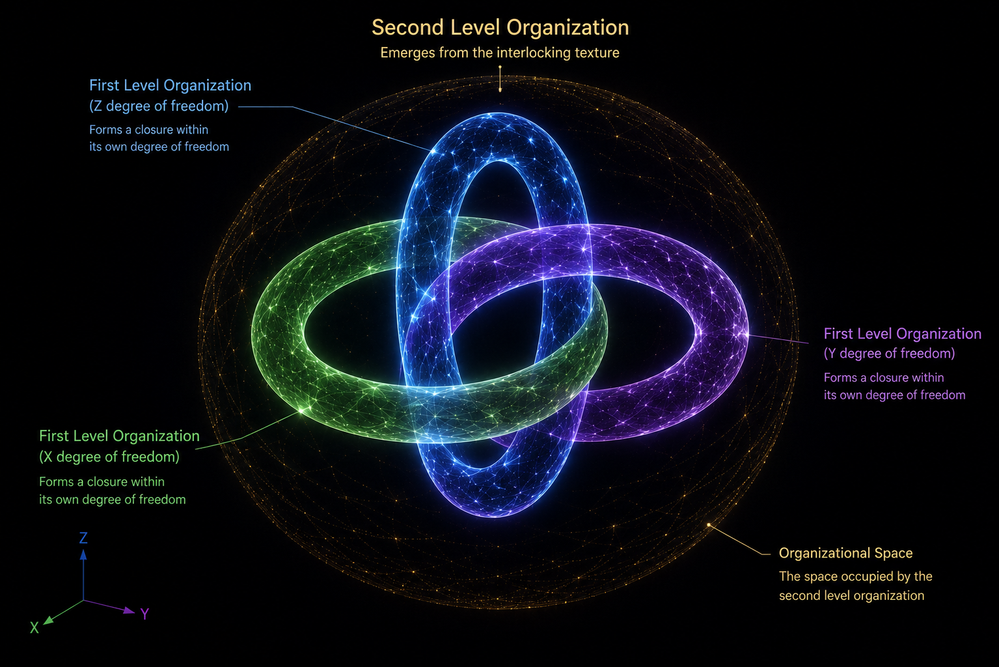
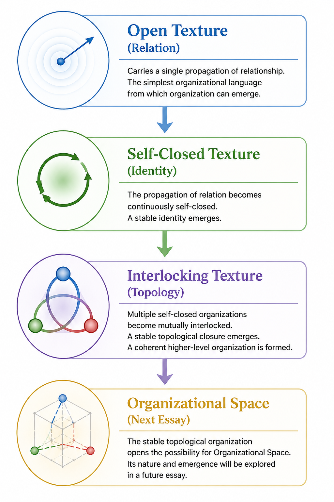

[🏠 Home](../../index.md) | [← Universe Crystal Essays](index.md)

# Universe Crystal Essay 001

## Why Texture Is the Most Elegant Idea in Universe Crystal

*A Unified Organizational Language Across Three Levels of the Standard Model*

When I first began developing Universe Crystal, one of the earliest decisions was to choose a language for describing its most fundamental substance.

I chose **Texture**.

At the time, the framework began with **Open Texture**, the simplest form of Texture. It carries a single propagation of relationship and serves as the starting point from which organization can emerge.

Initially, I regarded Texture simply as the foundation of the framework.

As the research gradually unfolded, however, something unexpected happened.

Texture never remained confined to the beginning.

As organizations evolved, Texture evolved with them.

It first became the basis for the emergence of a First Level Organization.

Later, it became the means through which multiple First Level Organizations could form a stable Second Level Organization.

Only then did I realize that I had been describing the entire construction of Universe Crystal using the same language all along.

The language never changed.

Only the organizational mode of Texture continued to evolve.

That realization completely changed the way I looked at the framework.

Texture was no longer simply its fundamental substance.

It had become the language through which the framework itself was woven.

What surprised me even more was that this evolving language naturally formed a remarkably coherent organizational interpretation across the representative organizational levels of the Standard Model.

That is why I now believe Texture is the most elegant idea in Universe Crystal.

In this essay, I would like to explain why.

---

# The Beginning of Texture

As described in the Discovery Series, Universe Crystal begins with Open Texture because its objective is not merely to describe existing objects, but to describe the evolving universe as a whole.

Open Texture carries a single propagation of relationship and provides the simplest organizational language from which organization can emerge.

If Open Texture carries a single propagation of relation, one question naturally follows.

**Can a single propagation of relation become a stable existence?**

Within the organizational language of Universe Crystal, the answer is no.

A single propagation of relation is only a single propagation.

It does not preserve itself.

It cannot become a stable organization.

This led to one of the earliest principles established in Universe Crystal.

> **Only closure can become stable.**

That simple principle became the starting point for the evolution of Texture itself.

---

# From Relation to Identity

The first evolution of Texture was not the introduction of a new substance.

It was the emergence of a new organizational mode.

When the propagation of relation becomes continuously self-closed, Open Texture evolves into **Self-Closed Texture**.

Texture remains the same.

Only the organizational pattern carried by Texture has changed.

This evolution marks the birth of the **First Level Organization**.

For the first time, relation no longer simply propagates.

It continuously closes back onto itself, preserving a stable identity.

Here, the same principle still applies.

> **Only closure can become stable.**

From the perspective of Universe Crystal, this also provides a natural organizational interpretation of why a First Level Organization appears as a point-like particle.

Its organization is completely occupied by self-closure.

Its stable existence is achieved entirely through relation closing back upon itself.

There is not yet a higher-level topology to unfold.

In this sense, the point-like nature of the First Level Organization is not an assumption.

It is a natural consequence of self-closure.

At this point, Texture had already evolved beyond carrying relation propagation alone.

It had become the organizational language through which stable identity could emerge.

---

# From Identity to Topology

The emergence of the First Level Organization did not complete the evolution of Texture.

Instead, it revealed the next organizational challenge.

If every First Level Organization has already achieved stability through Self-Closed Texture, how can multiple stable organizations become one stable Second Level Organization?

The answer is not another self-closure.

It is the emergence of another organizational mode of Texture.

This is **Interlocking Texture**.

Unlike Self-Closed Texture, which carries the self-closure of a single organization, Interlocking Texture carries the topological organization of multiple First Level Organizations.

Each First Level Organization occupies its own Organizational Degree of Freedom.

Within its own degree of freedom, it continuously winds while preserving its own stable identity.

These continuous windings do not evolve independently.

Through Interlocking Texture, they become mutually interlocked.

The winding within each degree of freedom is topologically constrained by the other two, and together they gradually form a stable topological closure.

Nothing is fused.

Nothing loses its own identity.

Instead, Interlocking Texture carries the entire organizational process through which three independent First Level Organizations become one coherent whole.

Once again, the same principle remains unchanged.

> **Only closure can become stable.**

This time, however, what becomes stable is no longer an individual organization.

It is the topology formed collectively by multiple stable organizations.

The stability of the Second Level Organization therefore does not arise from three point-like organizations alone.

It arises from the stable topological closure continuously carried by Interlocking Texture.

Texture has evolved once again.

- Open Texture carries the propagation of relation.
- Self-Closed Texture carries the self-closure of relation.
- Interlocking Texture carries the topological organization of multiple self-closed organizations.

The language remains the same.

Only its organizational capability continues to evolve.

The stable topological organization established through Interlocking Texture also opens the possibility for **Organizational Space**, a subject I will explore in a future essay.

---

# A Unified Organizational Language Across Three Levels of the Standard Model

Looking back, what surprised me most was not that Texture explains different organizational levels.

It was that the same organizational language continues to describe them without ever changing its fundamental principle.

At the level of relation propagation, Open Texture provides the simplest organizational language from which evolution begins.

At the level of elementary particles, Self-Closed Texture provides a natural organizational interpretation of stable point-like organizations.

At the level of composite particles, Interlocking Texture explains how multiple stable organizations become one stable higher-level organization through topological closure.

These are clearly different organizational modes.

Yet they all emerge through the continuous evolution of the same language.

This is not an attempt to replace the Standard Model.

Rather, Universe Crystal offers a unified organizational interpretation through which representative structures of the Standard Model can be understood from a single organizational perspective.

To me, that is the true elegance of Texture.

Texture never became just another concept within Universe Crystal.

Quietly, it became the language through which the entire framework could be woven.

---

[← Essay 000](essay-000.md) | [Universe Crystal Essays](index.md)