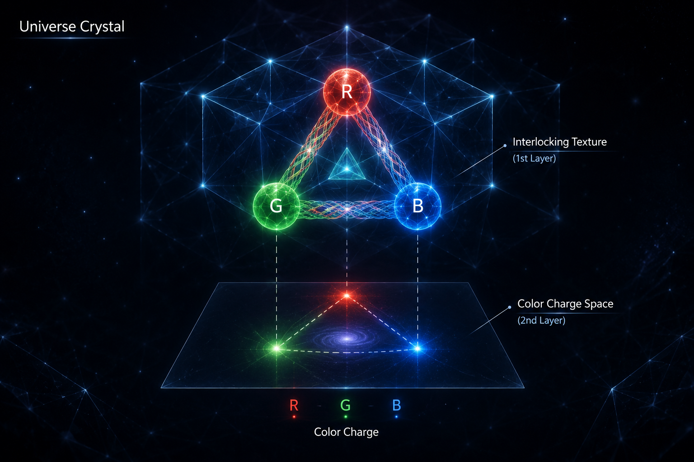

[🏠 Home](../../index.md) | [← Universe Crystal Essays](index.md)

# Universe Crystal Essay 002

## Where Does Color Charge Live in Universe Crystal?

*Color Charge as a Second Layer of Weaving*

*Continuation of Essay 001, “Why Texture Is the Most Elegant Idea in Universe Crystal.”*

In Essay 001, Texture was introduced as a single organizational principle spanning three levels of reality — Open Texture, Self-Closed Texture, and Interlocking Texture — unified by one rule:

**Only closure can become stable existence.**

That essay was about *form*.

This one is about *color*.

Because once we require Interlocking Texture to explain not only *that* fundamental particles can form composite structures, but *how* they form them — especially how three quarks form a proton — Texture must answer a question more difficult than whether it closes:

**What does it close with respect to?**

This essay proposes one answer, while also trying to honestly distinguish what is derived from what remains, for now, a useful picture.

## Where Does Color Live?

Essay 001 described Interlocking Texture as three First-Level Organizations, each occupying an Organizational Degree of Freedom, weaving together to form a shared topological closure.

At first, a natural idea was to assume that these three degrees of freedom were simply the three dimensions of physical space.

A quark exists somewhere; it has x, y, and z; that would seem to be enough.

But further consideration reveals an important problem with this idea.

If color were encoded in the same degrees of freedom as the particle's spatial orientation, then rotating a quark in space should change its color.

Yet color and spatial orientation are clearly independent properties. A particle can change its spatial orientation without changing its color.

This suggests that the organizational degree of freedom associated with color cannot simply be identified with the three dimensions of physical space.

Color requires its own independent organizational space — an internal weaving space carried by Interlocking Texture and existing beyond ordinary spatial orientation.

How many dimensions does this second space require?

Not three.

Not one.

It turns out to be **two**.

And this is not simply an arbitrary choice.

Three color states, if they are to remain symmetric and independently distinguishable, cannot naturally be represented along a single line.

A line provides only one independent coordinate.

But in a plane, three states can occupy the three vertices of a symmetric triangle, with each state defined through two independent coordinates.

Three colors, two independent organizational degrees of freedom, and a symmetric triangular structure.

When the requirement is that red, green, and blue remain genuinely symmetric rather than being assigned an arbitrary ordering, this provides the natural organizational structure for color.

The second space is therefore not ordinary physical space.

It is an internal organizational space associated with color — a second layer of weaving within the Interlocking Texture.

## The Medium Is Not Neutral

Essay 001 treated Interlocking Texture as a structure that connects organizations — something that allows three First-Level Organizations to lock together.

It is easy to imagine that the connecting structure itself is passive, a kind of transparent glue that carries nothing of its own.

But that picture cannot explain one particular fact:

Why does the force that holds quarks together behave so differently from the other forces we know?

Pull two electrically charged particles apart, and their interaction weakens.

But pull two quarks apart, and the interaction **strengthens**.

There is a known reason for this:

The mediator of the strong interaction is not neutral.

It carries the color charge it transmits, and therefore can interact with itself, whereas the mediator of electromagnetism — the photon — does not interact with itself in this way.

Therefore, within this framework, Interlocking Texture must be given a more active role:

It is not a neutral connector, but an active medium carrying net color charge between First-Level Organizations and, more importantly, capable of participating in interactions with other instances of Interlocking Texture.

## Counting the Weaving: From Nine to Eight

This is where the framework begins to acquire something more than a beautiful picture.

Three colors, each with a corresponding anti-color, produce nine possible color–anticolor combinations — nine candidate ways in which Interlocking Texture could transfer color between different First-Level Organizations.

Universe Crystal already has a principle that was established in Essay 001 and runs throughout the series:

**There is no static existence.**

Every organization in the framework is a process rather than a state.

Applied here, this principle imposes a specific requirement:

Among the nine candidate weaving operations, there cannot be an operation in which “nothing changes.”

And among these nine candidate combinations, there is exactly one such combination.

Among the nine color–anticolor combinations, there is one special symmetric combination — formed by the symmetric combination of red–anti-red, green–anti-green, and blue–anti-blue — whose overall effect is a pure identity transformation.

It returns any color state to itself.

It is the only one of the nine combinations that “does nothing.”

The principle of “no static existence” excludes it.

Therefore:

Nine candidate modes, minus one mode that violates the principle, leaves **eight** genuine Interlocking Texture color-weaving modes.

This is worth pausing over, because it is a different kind of claim from the one made in Part 9 about electric charge.

There, the number of turns in the weaving cycle was chosen to correspond to already known physical values.

Here, the number eight is not chosen.

It comes from two premises that were already fixed before the question of how many weaving operations exist was asked:

First, there are three colors — a result that had already been independently established through the requirement that identical fermions cannot occupy the same complete state.

Second, the framework does not permit anything to exist statically.

Whether this counts as a genuine derivation or merely a well-constructed line of reasoning, I leave that judgment to the reader — and to future papers, which should judge it more rigorously than I can judge it myself.

## Closure Is a Continuous Process, Not Something Already Completed

If color transformation is real — if First-Level Organizations are genuinely exchanging color — then closure cannot be a state that Interlocking Texture reaches once and then leaves unchanged.

It must be continuously re-established, because color is continuously moving.

Specifically:

Whenever the color of one First-Level Organization changes, Interlocking Texture must be understood as carrying a corresponding net color away from it — and that net color must reach another First-Level Organization within the same closed structure, triggering the corresponding color change there.

No transformation occurs in isolation.

Every weaving is a paired event, and the overall closure — the condition that originally allowed the whole structure to exist stably — is never actually broken during the process, because what leaves one organization always reaches another.

This changes the meaning of “stable” in a composite structure.

A proton, in this language, is not three quarks that once locked together and then stopped moving.

It is three quarks in a state of **permanent mutual weaving** — a closure maintained through continuous internal exchange rather than through a completed act of locking.

If that exchange were removed, even in principle, there would be nothing left to maintain the closure.

This may be why an isolated colored organization has never been observed to exist independently outside such an exchange:

Within this framework, perhaps there is no such thing as a color that is *not participating in an exchange process*.

## Where the Picture Stops Being a Derivation

Not every feature of the strong interaction can be argued through this framework in the same way.

The most obvious example is **scale dependence**:

The strong interaction becomes weaker at short distances and stronger at long distances.

Why this happens — and at precisely what rate it changes — is, in the standard theory, a genuine dynamical and cumulative calculation rather than a static fact about how many closure modes exist.

Universe Crystal does not yet have a variable that can describe this.

Everything established so far — the weaving space, the eight transformations, the continuous joint closure — describes *shape*:

What can close, what cannot close, and how closure can occur.

But none of these describes:

How tightly a closed structure “holds” when you change the scale at which you observe it.

So this essay ends with an image, while honestly treating it as an image rather than an argument:

Imagine three Interlocking Textures as three rings interlocked with one another.

When they are close together, the interlocking points become relaxed — the three rings can almost slide freely against one another.

As you pull them apart, the interlocking points become increasingly strained. The tension grows until — when they are pulled far enough — the structure breaks not by releasing the original rings, but by producing a new ring from the “vacuum” to fill the break.

The image captures the **direction** of asymptotic freedom and confinement:

The interaction becomes weaker when close;

it becomes stronger when separated;

and eventually isolation is avoided by producing new structure rather than releasing the original structure.

But it does not derive the **rate** at which this change occurs.

That gap — giving Universe Crystal a genuine concept of scale, allowing the framework to expand or contract its organizational scale on its own terms — is, in my view, the real problem the framework must solve next.

It is not a detail that needs to be patched.

It is the next question the framework must earn the right to answer.

**Read and comment on Medium:**

[Where Does Color Charge Live in Universe Crystal?](https://medium.com/@jerry.jiangheng/universe-crystal-essay-002-where-does-color-charge-live-in-universe-crystal-96c61d424872)
---

[← Essay 001](essay-001.md) | [Universe Crystal Essays](index.md) |  [Essay 003 →](essay-003.md)