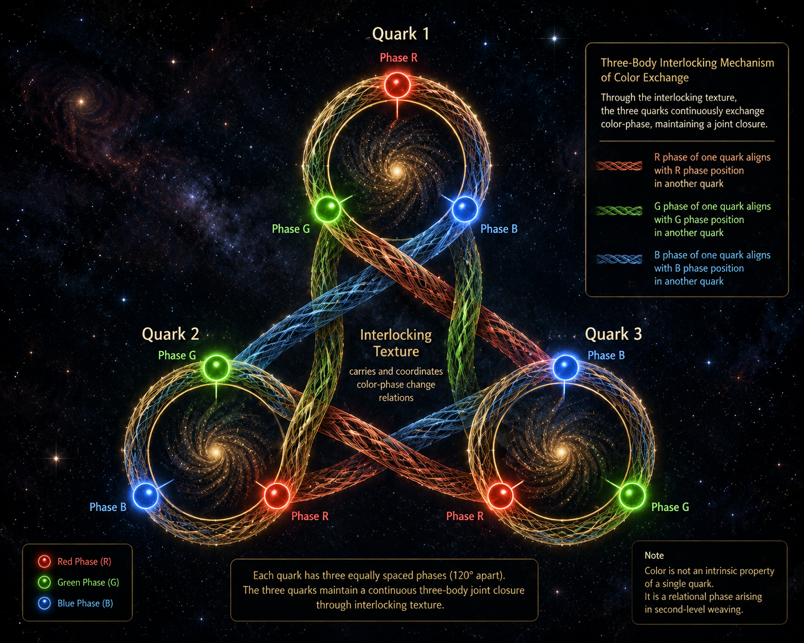

[🏠 Home](../../index.md) | [← Universe Crystal Essays](index.md)

# Universe Crystal Essay 003

## Color Charge as a Relational Phase of Second-Level Weaving

*A Further Interpretation of the Origin of Color Charge in Essay 002*




*Continuation of Essay 002, “Where Does Color Charge Live in Universe Crystal?”*

Essay 002 proposed that color belongs to a second layer of weaving, distinct from ordinary spatial organization, and that this internal organizational space can be understood as having two independent organizational degrees of freedom.

That gave us a way to locate color within Universe Crystal.

The next step is to understand more precisely what this color degree of freedom represents.

The proposal developed in this essay is:

**Color charge is a relational phase of Second-Level Weaving.**

It appears when already formed First-Level Organizations participate in the formation of a higher-order organization.

This gives color a different organizational status from the properties that arise during the formation of the First-Level Organization itself.

---

## Color Belongs to the Second-Level Weaving

In the Universe Crystal framework, a First-Level Organization is formed when Open Texture undergoes its own weaving and closure process.

The yarn analogy remains useful.

When loose yarn is woven into a knot, the yarn itself is being organized into a new structure. The twisting of the yarn provides an intuitive picture for the phase associated with electric charge, while the resulting organization of the knot provides an intuitive picture for the weaving pattern associated with spin.

These properties therefore belong to the process through which the underlying texture becomes a First-Level Organization.

Color enters at another level.

Once First-Level Organizations have formed, those organizations can themselves participate in another weaving process.

The objects being woven are no longer the original pieces of Open Texture.

They are already organized structures.

The organizational sequence therefore becomes:

Open Texture

→ First-Level Weaving

→ First-Level Organization

and then:

First-Level Organizations

→ Second-Level Weaving

→ Second-Level Organization

Color belongs to this second process.

A quark-like First-Level Organization first forms through its own closure. When it subsequently participates in higher-order weaving with other First-Level Organizations, a new relational state appears within that higher-order process.

That relational state is what Universe Crystal proposes to interpret as color.

---

## Color as a Relational Phase

The word phase becomes important here.

A phase can describe the state of a process or relationship.

If color is a phase of Second-Level Weaving, the relevant question is therefore not simply:

What color does this First-Level Organization possess?

The deeper question is:

**What phase is this First-Level Organization occupying within the higher-order weaving relationship in which it participates?**

Color therefore describes the state of an organization relative to the Second-Level Weaving connecting it with other organizations.

A change in color is consequently a change in this higher-order relationship.

When the phase of one First-Level Organization changes, the corresponding relation within the Second-Level Weaving changes as well.

This leads to the central proposition of this essay:

**Color charge is a relational phase of Second-Level Weaving.**

Color therefore appears when organization itself becomes the material of a new weaving process.

---

## Why the Second-Level Phase Can Require Two Degrees of Freedom

This interpretation also gives a concrete organizational intuition for the two degrees of freedom proposed in Essay 002.

The difference begins with the nature of what is being woven.

Before a First-Level Organization exists, Open Texture has no mass concept and no time concept within the organizational framework developed by Universe Crystal.

The weaving of Open Texture into a First-Level Organization is therefore a more primitive process.

Its phase can be pictured directly through the weaving line itself, such as the twisting phase used in the intuitive picture of electric charge.

Once the First-Level Organization has formed, the situation changes.

The First-Level Organization now has mass, and the emergence of organized persistence also gives rise to the time concept associated with this level of organization.

The objects participating in the next weaving process are therefore already organized entities with mass and temporal organization.

When such an entity participates in further weaving, describing its weaving phase naturally carries more information than describing the phase of the original Open Texture being woven into a First-Level Organization.

The difference can therefore be pictured as:

Open Texture → First-Level Organization

where the phase belongs directly to the weaving of the underlying texture,

while:

First-Level Organization → Second-Level Organization

describes the weaving of already organized entities that possess mass and temporal organization.

A richer phase description is therefore natural.

Within the current framework, two independent organizational degrees of freedom provide the simplest candidate for describing this higher-level phase.

The two degrees of freedom describe the internal organizational state of Second-Level Weaving.

They are part of the higher-order weaving structure introduced in Essay 002.

---

## Quark and Antiquark: Color and Anticolor

This interpretation also provides a natural organizational picture for color and anticolor.

A quark participates in Second-Level Weaving with a color state, while an antiquark participates with the corresponding anticolor state.

Within the weaving picture, these can be understood as corresponding orientations of the higher-order weaving process.

The simplest intuitive representation is the direction of weaving:

quark → color → one weaving orientation

antiquark → anticolor → corresponding opposite or conjugate weaving orientation

```text
Quark
  │
  ↓
First-Level Organization
  │
  ↓
Second-Level Weaving
  │
  ↻
Color Phase


Antiquark
  │
  ↓
First-Level Organization
  │
  ↓
Second-Level Weaving
  │
  ↺
Anticolor Phase
```

The opposite directions provide an intuitive representation of conjugate weaving orientations.

Thus:

**Color and anticolor can be understood as corresponding conjugate orientations of the higher-order weaving phase.**

This gives the relationship between quark and antiquark a natural place within the Universe Crystal weaving picture.

---

## What Does Interlocking Texture Transmit?

Essay 002 established that Interlocking Texture connects First-Level Organizations within a higher-order structure.

Now that color has been interpreted as a relational phase of Second-Level Weaving, we can ask a more precise question:

**What relationship does Interlocking Texture transmit between the participating First-Level Organizations?**

The earlier description was:

**Interlocking Texture transmits color between First-Level Organizations.**

The present interpretation allows this statement to become more precise.

If color is a phase, then the important process is the change of that phase.

When the color phase of one First-Level Organization changes, that change must remain coordinated with the color phases of the other First-Level Organizations participating in the same higher-order closure.

Therefore:

**Interlocking Texture transmits the relations between color-phase changes of First-Level Organizations.**

The process can be pictured as:

First-Level Organization A changes its color phase

→ Interlocking Texture carries the corresponding phase-change relation

→ the other First-Level Organizations undergo corresponding changes

→ the Second-Level closure remains coordinated

The relationship carried by Interlocking Texture is therefore:

**the relation between changes of color phase.**

This gives Interlocking Texture a much more precise role within the second-level organization.

It is the active weaving structure through which the phase changes of participating First-Level Organizations remain coordinated.

More precisely, the color exchange described here is not a process that occurs after the three First-Level Organizations have already been interlocked.

The exchange of color phase is part of the interlocking process itself.

When the color phase of one First-Level Organization changes, the corresponding phase-change relation is carried through the Interlocking Texture and coordinated with another participating First-Level Organization. The resulting phase change in the other organization is therefore part of the same higher-order weaving process.

In this sense, what appears as color exchange is the dynamic manifestation of the interlocking itself.

---

## Eight Color-Phase Change Relations

Once color and anticolor are understood as corresponding orientations of the higher-order weaving phase, the structure gives rise to eight non-trivial color-change relations.

These are the relations that Interlocking Texture needs to carry in order to coordinate the color phases of the participating First-Level Organizations.

The eight relations can therefore be understood as:

**eight distinct non-trivial relations through which the color phase of one First-Level Organization can change relative to another within Second-Level Weaving.**

The identity relation contains no color-phase change and therefore does not contribute a phase-change relation.

These eight relations are therefore not eight additional color states. They are the non-trivial relations through which the color phases of participating First-Level Organizations can change relative to one another within the interlocking process.

The resulting structure is:

**Eight non-trivial color-phase change relations carried by Interlocking Texture.**

This provides a more precise interpretation of the eight-fold structure introduced in Essay 002.

It also creates a natural organizational correspondence with the eight gluon degrees of freedom in QCD.

The correspondence can therefore be expressed as:

eight color-phase change relations

↔

eight gluon degrees of freedom

The Universe Crystal interpretation gives these eight degrees of freedom an organizational meaning: they represent the distinct non-trivial ways in which color phase can change and be coordinated through the higher-order weaving.

---

## Color Closure as Continuous Phase Coordination

This interpretation gives color closure a more precise meaning.

The three First-Level Organizations forming a proton are not simply three independent structures carrying three static color labels.

Their color phases participate in one Second-Level Weaving process.

When one First-Level Organization changes its color phase, Interlocking Texture carries the corresponding phase-change relation so that the other participating organizations remain coordinated within the same higher-order closure.

Thus:

**Color closure is the continuous coordination of the color phases of the participating First-Level Organizations.**

The closure is maintained through the organization of their changing phases.

The proton can therefore be represented as:

Three First-Level Organizations

→ Second-Level Weaving

→ Interlocking Texture

→ Color-Phase Relations

→ Continuous Phase Coordination

→ Second-Level Closure

The interlocking is therefore not a structure established first and followed by color exchange afterward. The mutual color-phase coordination is part of the mechanism through which the three organizations remain interlocked and collectively closed.

The proton is consequently a higher-order organization maintained through continuous mutual weaving.

---

## Electric Charge, Spin, and Color Enter the Same Framework

This is one of the most important results of the present research.

Electric charge, spin, and color can now begin to be described using the same Universe Crystal language of weaving, organization, and phase-like structure.

For electric charge, the yarn analogy remains direct.

When Open Texture is woven into a First-Level Organization, the weaving line can twist, and the twisting of the weaving provides an intuitive picture for the electric-charge phase.

For spin, the more appropriate analogy is the weaving pattern of the resulting First-Level Organization.

The knot formed by the yarn can have an internal organization that is not captured by one fixed classical shape. Different weaving patterns can be superposed, and what measurement reveals is a quantum spin state rather than a predetermined classical geometric shape.

Spin can therefore be pictured, within the current Universe Crystal language, as:

**the weaving pattern of the First-Level Organization and its quantum state.**

Color enters at the next organizational level.

When First-Level Organizations themselves become the elements of a new weaving process, color can be understood as:

**the relational phase of Second-Level Weaving.**

The three concepts can therefore be placed within one continuous organizational sequence:

```text
Open Texture
     │
     │ First-Level Weaving
     ↓
First-Level Organization
     │
     ├── Twisting of the Weaving
     │        ↓
     │      Electric Charge
     │
     ├── Weaving Pattern
     │        ↓
     │      Spin
     │
     │
     │ Second-Level Weaving
     ↓
Relational Weaving Phase
     │
     ↓
Color Charge
     │
     ↓
Interlocking Texture
     │
     ↓
Color-Phase Change Relations
     │
     ↓
Second-Level Closure
```

This creates a common organizational language:

Electric charge can be understood through the twisting phase of the weaving that forms a First-Level Organization.

Spin can be understood through the weaving pattern and quantum state of the First-Level Organization.

Color charge can be understood through the relational phase that appears when First-Level Organizations participate in Second-Level Weaving.

The three properties therefore occupy different positions in the organizational hierarchy, while becoming understandable through the same underlying language of weaving and organization.

---

## From First-Level Weaving to Second-Level Weaving

The distinction can now be expressed very simply.

Electric charge concerns:

**How Open Texture is woven into a First-Level Organization.**

Spin concerns:

**The weaving pattern of the First-Level Organization that results from this organization.**

Color concerns:

**How already formed First-Level Organizations participate in a higher-level weaving relationship.**

Therefore:

**Electric charge is associated with the twisting phase of First-Level Weaving.**

**Spin is associated with the weaving pattern and quantum state of the First-Level Organization.**

**Color charge is associated with the relational phase of Second-Level Weaving.**

This gives the three properties a common organizational context.

The important shift is that color no longer needs to be treated simply as another property appearing inside the First-Level Organization.

It belongs to the relationship through which First-Level Organizations become part of a larger organization.

---

## The Role of Interlocking Texture

The role of Interlocking Texture can now be stated precisely.

It is the active structure of Second-Level Weaving through which the color-phase changes of participating First-Level Organizations remain related.

The organizational sequence is:

First-Level Organization

→ Color Phase

→ Color-Phase Change

→ Interlocking Texture

→ Phase-Change Relation

→ Coordination

→ Second-Level Closure

Interlocking Texture therefore provides the relational structure required for the higher-order organization to maintain its closure while its internal phases continue to change.

The color exchange is consequently not an additional function attached to an already completed interlocking structure. It is part of the continued higher-order weaving through which the interlocking is maintained.

This gives the concept of Interlocking Texture a more precise meaning than simply “three organizations locked together.”

It is the active structure of their continued higher-order weaving and the mechanism through which their color-phase changes remain mutually coordinated.

---

## A Unified Universe Crystal Picture

The current interpretation can be summarized as:

```text
                         Universe Crystal
                                │
                                ↓
                          Open Texture
                                │
                                │ First-Level Weaving
                                ↓
                    ┌───────────┴───────────┐
                    │                       │
              Twisting Phase           Weaving Pattern
                    │                       │
                    ↓                       ↓
                 Charge                   Spin
                    │                       │
                    └───────────┬───────────┘
                                ↓
                    First-Level Organization
                                │
                                │
                                │ Second-Level Weaving
                                ↓
                    Relational Weaving Phase
                                │
                                ↓
                           Color Charge
                                │
                                ↓
                     Interlocking Texture
                                │
                    Color-Phase Change Relations
                                │
                                ↓
                     Second-Level Closure
```

The significance of this picture is that particle properties can now be investigated according to the organizational level at which they arise.

The first weaving produces the First-Level Organization.

The organization has its own weaving pattern.

The resulting organizations can then become the elements of a second weaving process.

That second process has its own relational phase.

Color charge belongs to that second process.

---

## Conclusion

Essay 002 established that color belongs to a second layer of weaving.

Essay 003 now proposes a more precise interpretation:

**Color charge is a relational phase of Second-Level Weaving.**

A quark-like First-Level Organization first forms through its own closure and then participates in higher-order weaving with other First-Level Organizations.

Its color therefore describes its state within that higher-order weaving relationship.

An antiquark carries the corresponding anticolor, which can be pictured as the opposite or conjugate orientation of the same higher-order weaving phase.

Interlocking Texture coordinates these relationships by carrying the changes of color phase between participating First-Level Organizations.

The color exchange is therefore understood as the dynamic manifestation of the interlocking mechanism itself, through which the three First-Level Organizations continuously coordinate their higher-order phases.

In this picture:

**Interlocking Texture transmits eight non-trivial color-phase change relations.**

These relations provide an organizational interpretation for the eight-fold color structure associated with the gluon degrees of freedom.

Most importantly, electric charge, spin, and color charge can now be described within one continuous Universe Crystal organizational picture:

**Electric charge — the twisting phase of First-Level Weaving.**

**Spin — the weaving pattern and quantum state of the First-Level Organization.**

**Color charge — the relational phase of Second-Level Weaving.**

The three properties arise at different organizational levels, but they can now be studied through one common language of texture, weaving, organization, and phase.

This gives Universe Crystal a more unified way to investigate why elementary particles possess the properties they do, and how those properties may emerge from successive levels of organization.


**Read and comment on Medium:**

[Color Charge as a Relational Phase of Second-Level Weaving](https://medium.com/@jerry.jiangheng/universe-crystal-essay-003-color-charge-as-a-relational-phase-of-second-level-weaving-a-further-631a1ba8d884)
---

[← Essay 002](essay-002.md) | [Universe Crystal Essays](index.md)