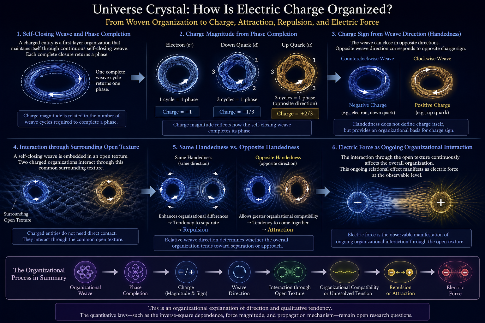

[🏠 Home](../../index.md) | [← Universe Crystal Essays](index.md)

# Universe Crystal Essay 004

## How Does Universe Crystal Organize Electric Charge?

*From Organizational Weaving to Charge, Attraction, Repulsion, and Electric Force*

Electric charge is one of the most fundamental properties of matter. An
electron carries a charge of −1, while up and down quarks carry
fractional charges of +2/3 and −1/3. Like charges repel, unlike charges
attract, and charged objects exhibit electric force across space. Modern
physics describes these phenomena with remarkable precision, yet from
the organizational perspective of Universe Crystal, a deeper question
remains: **Can electric charge, its positive and negative signs,
attraction and repulsion, and electric force be understood as different
expressions of the same underlying organizational process?**

Universe Crystal approaches this question through organizational
weaving. A First Level Organization maintains itself through continuous
self-closure, and each complete closure returns a phase. The number of
weaving cycles required to complete such closure provides a possible
organizational basis for the magnitude of charge. From this starting
point, the sign of charge can be further related to the direction of the
weaving, while the interaction between different charged organizations
through the surrounding Open Texture may determine whether the overall
organization favors separation or convergence. In this way, charge
magnitude, charge sign, attraction, repulsion, and electric force can be
studied within one organizational process.

The central question of this essay is therefore not simply how to
explain a particular charge value, but how to establish a continuous
relation from organizational weaving to electric interaction: **How does
organizational weaving form charge, how does the direction of weaving
correspond to the positive and negative signs of charge, and how can the
relation between different charged organizations appear as attraction,
repulsion, and electric force?**

---

## Charge as a Completed Weaving Phase

A First Level Organization is not formed by a single act of closure and
then left unchanged. It maintains itself through continuous
self-closure: Open Texture continually returns upon itself, forming an
organized propagation pattern capable of maintaining its own
organization. Within this process, each complete closure returns a
phase, and electric charge can first be approached through this
phase-completion structure.

For the electron, one complete weaving cycle returns the organization to
its full closure phase and therefore corresponds to one unit of charge,
expressed as −1. For quarks, closure can be understood as taking a
different organizational pattern in which the return is distributed
across three cycles, so that each cycle corresponds to one third of the
full phase. In this way, −1/3 can be associated with down-type quark
weaving, while the opposite weaving direction corresponds to +2/3 for
up-type quark weaving.

The precise physical meaning of these values remains a subject for
further research, but an organizational relation can already be
proposed: **the magnitude of electric charge can be related to the
degree of phase completion within a self-closing weaving pattern.**
Charge is therefore no longer treated only as an isolated numerical
property attached to a particle; it can be approached as a discrete
organizational characteristic arising from the completion structure of
its weaving.

This interpretation can also be extended to composite structures. A
proton contains two up-type quarks and one down-type quark, giving
+2/3 + +2/3 − 1/3 = +1, while a neutron contains one up-type quark and
two down-type quarks, giving +2/3 − 1/3 − 1/3 = 0. In this sense, the
charge of a composite structure can be understood as the organizational
sum of the charges carried by the First Level Organizations that
constitute it, without requiring a separate source of charge for the
composite object.

However, phase completion primarily provides an organizational
interpretation of charge magnitude. The positive and negative character
of charge requires the directional structure of the weaving itself to be
considered further.

---

## Charge Sign and Winding Direction

A weaving process has not only a degree of phase completion but also an
organizational direction. A closed propagation can follow one direction
or the opposite direction, so two organizations can have similar phase
structures while possessing opposite winding orientations. For
simplicity, these orientations can be described as clockwise and
counterclockwise, or more generally as opposite forms of winding
handedness.

Within the current Universe Crystal interpretation, positive and
negative charge can be associated with opposite winding handedness. One
orientation can correspond to positive charge, while the opposite
orientation corresponds to negative charge. The point is not to define
electric charge itself as handedness, but to consider winding direction
as a possible organizational source of the sign of charge. Charge can
therefore be approached through two related organizational aspects: its
magnitude, associated with the degree of phase completion, and its sign,
associated with the direction of the weaving.

This distinction becomes particularly important when two charged
organizations coexist. A Self-Closed Texture does not become completely
separated from the Texture around it simply because it has formed a
closure. It remains embedded within Open Texture and continues to exist
within the same relational environment. Consequently, the weaving
structure of a charged organization is not confined to itself alone;
through the surrounding Open Texture, it participates in a wider
organizational relation. It is within this relational environment that
the interaction between charges can be considered.

---

## The Relation Between Closed Weaving and Surrounding Open Texture

A Self-Closed Texture can be understood as a persistent organization
within Open Texture. It possesses its own closed structure while
remaining embedded in a larger relational Texture. Closure therefore
does not eliminate the relation between the organization and its
environment; rather, it forms a specific organization that can maintain
itself within Open Texture.

From this perspective, charge should not be understood only as a
mathematical number attached to a particular spatial position. The
organizational pattern associated with charge exists within Open Texture
and participates in a wider relational structure. Two charged
organizations may be separated in space without being disconnected from
one another, because both remain embedded within the same Open Texture
and can therefore participate in a common relational structure.

Once this interaction is considered, the relative winding direction of
the two organizations becomes significant. If two organizations have the
same winding direction, they possess the same directional organization;
if they have opposite winding directions, their directional
organizations are reversed. Attraction and repulsion can therefore be
investigated as two different manifestations of these relative
organizational relations.

---

## Same Handedness and Opposite Handedness

Consider two charges with the same winding direction. Two positive
charges have the same handedness, and two negative charges likewise have
the same handedness. When their surrounding organizational patterns
interact through Open Texture, the same directional organization may
reinforce an unresolved organizational difference between them, causing
the overall configuration to favor greater separation. At the observable
level, this organizational configuration appears as repulsion between
like charges.

For two charges with opposite winding directions, one organization
closes along one direction while the other closes along the opposite
direction. When their surrounding organizational patterns interact
through Open Texture, opposite handedness may permit a greater degree of
organizational compatibility, causing the overall configuration to favor
reduced separation. At the observable level, this appears as attraction
between unlike charges.

Thus, within the current organizational interpretation, same and
opposite winding directions are not merely classification labels. They
may determine different organizational tendencies in the relation
between charged structures. The relationship can be expressed as
follows: **the same handedness may favor a configuration of greater
separation, while opposite handedness may favor a configuration of
greater convergence; at the observable level, these appear respectively
as repulsion and attraction.**

This is an organizational interpretation of the direction of electric
interaction rather than a derivation of its complete dynamics. The
deeper question is why such organizational relations produce the
electric effects we observe, and how the strength and distance
dependence of those effects arise from the structure of Open Texture.

---

## Attraction and Repulsion as Organizational Reorganization

The interaction between charged organizations can be understood within a
broader organizational principle of Universe Crystal: a continuing
organization tends toward configurations that support the continuation
of its organization. When relations between different organizations
produce greater unresolved organizational tension, the overall
configuration may reorganize in a way that reduces that tension; when a
relation permits greater organizational compatibility, the configuration
may reorganize toward that compatibility.

For like charges, increasing the separation between them can reduce the
interaction between similarly handed organizational patterns, so the
overall organization appears to favor separation. For unlike charges,
decreasing the separation can increase the relation between oppositely
handed organizations, so the overall organization appears to favor
convergence. In this way, **like sign → separation → repulsion** and
**unlike sign → convergence → attraction** can be understood as two
outcomes within the same organizational reorganization process.

The significance of this interpretation is that attraction and repulsion
do not need to be introduced as two completely independent fundamental
rules. They may instead be different directional expressions of the same
organizational relation under different relative winding structures. The
positive and negative signs of charge distinguish the winding
directions, while the relative winding directions of two charges
determine the organizational tendency of their interaction.

---

## A Simple Analogy: Opposing Gear Directions

To visualize this directional organizational relation, consider the
analogy of two gears. For two gears to mesh smoothly, their local
rotational directions at the interface need to form a compatible
relation. If the gears are forced into an incompatible rotational
relationship, the interface produces resistance. The analogy therefore
helps illustrate why relative direction can influence organizational
compatibility.

The analogy is not intended as a description of the physical mechanism
of electric charge. Charges do not need to make mechanical contact, and
electric interaction is not proposed to arise from mechanical collision
between two objects. The gear analogy serves only as an intuitive
illustration of the possible organizational role of relative winding
direction. In Universe Crystal, the actual interaction is understood as
occurring through the surrounding Open Texture.

---

## What Is Electric Force?

When two charges exhibit attraction or repulsion, a deeper question
naturally arises: what exactly is the "force" involved in this
interaction? In conventional physical language, force is often described
as a quantity acting between objects and changing their motion. From the
organizational perspective of Universe Crystal, however, a more
fundamental starting point can be the continuing relational process
between organizations.

A charged Self-Closed Texture maintains its organization through
continuous weaving, while remaining embedded within the relational
environment formed by surrounding Open Texture. Another charged
organization is embedded in the same Open Texture. The two organizations
therefore participate in a shared relational structure, and their
interaction changes the overall organizational configuration.

At the observable level, this change appears as a directional effect:
like charges exhibit repulsion, while unlike charges exhibit attraction.
Within this organizational interpretation, **electric force can
therefore be understood as the observable expression of an ongoing
organizational interaction between charged organizations through Open
Texture.**

The important point is the connection between force and relation. Force
does not have to be introduced first as an independent entity existing
between two charges; it can instead be investigated as the observable
consequence of an ongoing relation between organizations. How that
relation propagates in detail, how it produces a definite force
magnitude, and how it corresponds to the mathematical structure of the
electromagnetic field remain subjects for further research.

---

## Charge, Sign, and Electric Force as One Organizational Process

The organizational interpretation can now be connected as a single
process. Charge magnitude is related to phase completion within
organizational weaving, while charge sign is related to the direction of
that weaving. A charged organization participates in a wider relational
structure through Open Texture. When two charged organizations interact,
their relative winding directions may cause the overall configuration to
favor separation or convergence; the same handedness may produce a
stronger organizational difference and favor separation, while opposite
handedness may allow greater organizational compatibility and favor
convergence. At the observable level, these configurations appear as
repulsion or attraction, while the continuing relational interaction
appears as electric force.

The process can therefore be summarized as:

**Organizational weaving → phase completion → electric charge → winding
direction → interaction through Open Texture → organizational
compatibility or unresolved tension → repulsion or attraction → electric
force.**

The significance of this sequence is that charge magnitude, charge sign,
attraction, repulsion, and electric force are no longer treated as
unrelated physical facts. They can be studied as different
manifestations of one underlying organizational process. Charge
expresses a particular completion structure of organizational weaving,
its positive or negative sign is associated with a difference in winding
direction, and the interaction between charged organizations expresses
the relation between those different organizational structures.

---

## What This Account Has Not Yet Explained

This organizational interpretation leaves several important questions
open, and these questions define the next stage of research.

The first is the distance dependence of electric interaction. The
observed electrostatic force between point charges follows Coulomb's
law, **F = kq₁q₂/r²**, while the current Universe Crystal interpretation
addresses the organizational direction of interaction: same handedness
favors separation and opposite handedness favors convergence. It does
not yet explain why the interaction strength follows precisely an
inverse-square dependence on distance. The exponent 2 therefore remains
an open organizational question.

The second is the quantitative magnitude of electric force. The present
framework has not yet derived the Coulomb constant from the structure of
Open Texture, nor has it explained why electromagnetic interaction has
the measured strength it does or why that strength has its observed
relationship to the strong and weak interactions. A more complete
physical account would need to establish a connection between the
organizational structure of Open Texture and measurable interaction
strength.

The third is the detailed mechanism of propagation. Open Texture,
organizational interaction, and winding compatibility provide a
conceptual organizational framework, but they do not yet constitute a
complete mathematical dynamical structure for propagation. Future
research must investigate what mathematical organization can describe
this propagation and how an electromagnetic field can emerge from more
fundamental relations within Texture.

These are not peripheral details to be added after the interpretation is
complete. They are the next research questions that arise directly from
the organizational framework.

---

## From Charge to Electric Interaction

Electric charge can be understood as an organizational property
associated with self-closing weaving. Its magnitude can be related to
phase completion, while its positive or negative sign can be associated
with winding direction. A charged organization remains embedded within
Open Texture and can therefore participate in a wider relational
structure. When two charged organizations interact through Open Texture,
their relative winding directions may cause the overall configuration to
favor separation or convergence, which appears at the observable level
as repulsion or attraction. The continuing relational interaction is
then observed as electric force.

The current Universe Crystal interpretation can therefore be summarized
as follows: **electric charge is associated with organized weaving and
phase completion; its sign is associated with winding direction;
attraction and repulsion arise from the interaction between charged
patterns with different organizational relations; and electric force is
the observable expression of this continuing organizational
interaction.**

The deeper question is therefore no longer simply why a particle
possesses electric charge. It becomes a broader organizational question:

**How does a particular mode of organizational weaving form electric
charge, produce the distinction between positive and negative charge,
interact with other charged organizations through Open Texture, and
ultimately produce the quantitative laws observed in electromagnetism?**

This defines the next level of the Universe Crystal investigation.

**Read and comment on Medium:**

[How Does Universe Crystal Organize Electric Charge?](https://medium.com/@jerry.jiangheng/universe-crystal-essay-004-how-does-universe-crystal-organize-electric-charge-5d233f76da77?sharedUserId=jerry.jiangheng)
---

[← Essay 003](essay-003.md) | [Universe Crystal Essays](index.md) |  [Essay 005 →](essay-005.md)