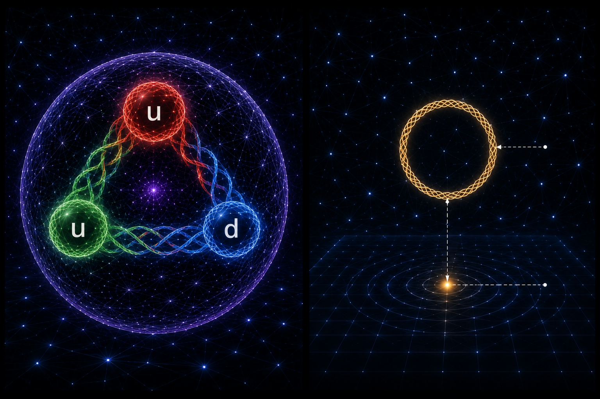

[🏠 Home](../../index.md) | [← Universe Crystal Essays](index.md)

# Universe Crystal Essay 005

## How Does Space Emerge in Universe Crystal?

*From Collective Closure to Emergent Spatiality*

# Space Before Space

Space appears fundamental because everything we experience as physical existence seems to stand within some kind of spatial relation. Particles have positions, atoms occupy volume, macroscopic objects have boundaries, and different physical systems form relationships through distance, direction, and relative position. Classical physics therefore naturally treats space as one of the basic structures within which physical events occur.

Universe Crystal asks a deeper question: does space already exist as a background before organization appears, or is space itself an emergent property produced when organization develops to a certain level?

Universe Crystal takes the second possibility as its working direction. Space is not a pre-existing container, nor is it a stage on which organization simply takes place. Space emerges when relational propagation becomes organized, when organization develops into collective closure, and when that collective structure acquires higher-order relational distinctions.

In other words, Universe Crystal does not begin with the assumption that objects exist in space. It asks instead: how can organization itself eventually produce what we call space?

# Before Space

At the deepest level of Universe Crystal is Open Texture. Open Texture carries relation and propagation, but at this level the properties normally associated with space have not yet emerged, so it should not be understood as matter or as an object already situated inside a three-dimensional container.

There is no pre-defined length, distance, or direction at this level, and there is no three-dimensional volume already waiting for an organization to enter it. The point is not that “nothing exists in space,” but that space itself has not yet appeared as a form of organizational relation.

This changes the usual picture of the origin of the universe. The universe does not begin with a vast spatial container into which organizations are placed. What exists first is relation and propagation, and organization must progressively form structures rich enough for position, boundary, interior, exterior, and extension to acquire meaning.

Space, therefore, may be a result of organizational development rather than a precondition for it.

# From Closure to Organization

The earliest stable organizations arise through Self-Closed Propagation. A First-Level Organization can maintain its organizational identity through continuous closure, becoming a stable organizational structure that can be distinguished and recognized.

Yet an individual First-Level Organization, although it possesses organization, identity, and internal relational structure, is still insufficient to constitute physical space. It can exist as a stable whole without requiring an extended internal spatial volume.

The conditions for spatiality begin to appear when organization is no longer limited to a single closure and multiple First-Level Organizations begin to organize one another. When these organizations become woven together through Interlocking Texture, the relations between them themselves become part of a higher-level organization. Organization is no longer simply the closure of one organization upon itself; it becomes the closure of multiple organizations together with their relations.

When these mutual relations form a Collective Closure, a new organizational level emerges, and it is at this level that the origin of spatiality begins to become visible.

# From Collective Closure to Organizational Topology

Collective Closure does more than connect multiple organizations. More importantly, it establishes an Organizational Topology capable of maintaining stable distinctions among different relational regions.

When multiple organizations are incorporated into the same collective closure, a structural distinction can arise between what belongs within the organization and what lies outside it, while the relations constituting that distinction form a boundary. Interior, boundary, and exterior therefore do not need to be introduced as pre-existing spatial concepts; they can emerge as structures generated by the organization itself.

An interior can be understood as an interior because it maintains a stable organizational distinction from an exterior. A boundary exists because it carries the relational structure of that distinction. An exterior can be defined because it stands in relation to an interior.

The earliest form of spatiality is therefore not length or volume. It is the capacity of organization to establish stable distinctions among interior, boundary, and exterior.

This forms the central idea of Universe Crystal's account of spatial emergence:

**When relations form a stable Organizational Topology through Collective Closure, spatiality begins to emerge.**

Space is therefore not an independent background outside organization. It becomes a new organizational property produced by collective organization.

# When Organization Becomes Spatial

This view also requires us to reconsider what it means for an object to “occupy space.” In the conventional description, an object exists first and is then assigned a position, extension, and boundary in space. In Universe Crystal, the order can be understood in the opposite direction: relations first form collective organization; collective organization establishes an Organizational Topology capable of distinguishing interior, boundary, and exterior; only then do concepts such as position, extension, and volume become meaningful descriptions of the organization within that structure.

Space is therefore not a priori coordinate system, but a result of the emergence of spatial relations once relations acquire a sufficiently high level of collective organization.

In this sense, spatiality emerges organizationally before it appears geometrically. Geometry is not the deepest starting point; it can instead be understood as the large-scale expression of a deeper Organizational Topology. The continuous space we experience is a further macroscopic manifestation of this organizational structure.

The relationship can therefore be summarized as follows:

**Organization precedes spatial relation, and spatial relation is subsequently expressed as geometry.**

# How Color Emerges in Collective Organization

The organization of quarks provides a particularly important concrete example in this account of spatial emergence, but one point must first be made explicit based on the current research direction: Color is not a property that a quark carries as a First-Level Organization before entering a higher-level organization. Rather, Color emerges as a collective organizational property when multiple First-Level Organizations become woven into a Second-Level Organization through Interlocking Texture.

Once multiple First-Level Organizations enter mutually interlocking relations, their internal organizational degrees of freedom are no longer simply separate. They become coordinated through Interlocking Texture. Within this process, a continuous organizational transformation can emerge and manifest through transitions among color states.

This collective organization can be represented schematically as:

**A → B → C → A**

The important point is not to interpret A, B, and C simply as three pre-existing “colors,” but as organizational states that can transform into one another within the collective weaving process and eventually return to the original configuration. Color therefore appears as a manifestation of the formation of the Second-Level Organization rather than as an input carried by each First-Level Organization into that organization.

Color cannot therefore be fully understood independently of the process through which the Second-Level Organization is formed. It is a property that emerges when multiple First-Level Organizations become collectively woven through Interlocking Texture, and this collective organization forms a continuous closure cycle.

The quark organization thus provides a concrete example in Universe Crystal: the emergence of Color and the formation of Collective Closure are different manifestations of the same higher-level organizational process.

# How Three Organizations Form the Minimum Collective Closure

If we ask why space should have three independent spatial degrees of freedom, the question cannot be reduced to a numerical correspondence such as “there happen to be three quarks.” What must be understood is the structure created by the relationships among three organizations.

Within the Universe Crystal framework, two First-Level Organizations can form a mutual relation, for example:

**A ↔ B**

Such a structure establishes a relation between two organizations, but it does not provide the minimum multi-member closure required here, because a third organization is needed to complete an independent closed relational cycle.

When a third First-Level Organization is added, the relation can become:

**A → B → C → A**

The three organizations now form a genuine Collective Closure. Each organization participates in the whole closure while remaining part of its own organizational relation, and the relational structure as a whole can return to its original organizational position through the third member, forming a complete minimum closure cycle.

This distinction is important for spatial emergence because a collective organization with meaningful internal structure requires some form of interior, boundary, and exterior. A simple mutual relation between two organizations can establish connection, but it does not yet provide the full structural condition for a collective closure with a distinct interior. Three mutually interlocking organizations are the first configuration that can provide the minimum relational condition for such closure.

Universe Crystal therefore proposes an important structural hypothesis:

**Three mutually interlocking First-Level Organizations constitute the minimum number of organizations capable of forming a Collective Closure.**

If this is indeed the minimum condition for stable collective organization, then “three” is no longer merely an observed number. It may become a structural source of the dimensionality of space.

# Why Three Spatial Dimensions May Emerge from Three-Organization Closure

Within this framework, three-dimensional space is not produced because Universe Crystal prescribes three spatial dimensions in advance, nor because three elements happen to appear in the underlying structure and are then simply mapped onto three directions.

The real question is why the minimum stable Collective Closure formed by three First-Level Organizations should naturally produce three independent spatial degrees of freedom.

When three organizations become woven through Interlocking Texture, they form a collective closure in which each organization participates in the whole while retaining its own relational organization. The mutual weaving of the three organizations produces a collective whole with stable internal distinctions; these distinctions provide the first structural condition for an organization to possess an interior, a boundary, and an exterior, and thereby support spatial extension.

Three-dimensional space can therefore be understood as a spatial manifestation of this minimum stable Collective Closure.

*The structural relationship can be summarized as:*

Three First-Level Organizations

↓

Mutually interlocking collective relations

↓

Minimum closure cycle

**A → B → C → A**

↓

Collective Closure

↓

Interior / Boundary / Exterior

↓

Three Spatial Degrees of Freedom

This hypothesis has a particularly important structural correspondence with the formation of Second-Level Organizations from quarks: three First-Level Organizations become collectively woven through Color-related Interlocking Texture, and the resulting Collective Closure forms a whole with internal organization.

The proposed relationship between the three-quark structure and three-dimensional space is therefore not that Color is equivalent to a spatial dimension. Rather, the three-member collective closure may provide a common structural basis through which both Color organization and Spatiality emerge.

# Why Two Organizations Are Not Enough

This also makes the two-organization configuration an important contrast. If only two First-Level Organizations are present, they can establish a mutual relation, but they cannot form a minimum closure cycle of the form A → B → C → A because there is no third organization to complete an independent closed relational structure.

Such a structure can contain relation, but it may not be sufficient to establish a collective organization with the stable interior, boundary, and exterior required for a spatial volume. It therefore lacks the structural condition proposed here for the emergence of a stable spatially extended collective organization.

From this perspective, three is not an arbitrary choice but may be the minimum number required for a stable spatial organization to form.

There is also a potentially significant correspondence with modern physics: combinations of two strongly interacting fundamental constituents generally do not form stable ordinary hadrons, whereas three-quark organizations can form baryonic structures. Universe Crystal cannot claim from this correspondence alone that it has explained hadron stability, but the relationship provides a direction for further investigation: whether stable Second-Level Organization, three-member closure, and three-dimensional spatiality share a common organizational basis.

# How Does a First-Level Organization Acquire a Spatial Position?

Once spatiality has emerged from higher-level collective organization, a new question arises: if a First-Level Organization does not itself possess extended spatial volume, how can it have a position within space?

The distinction that matters here is between having a spatial position and possessing spatial extension. They are not the same property.

A First-Level Organization can participate as a point-like local manifestation within a higher-level organizational structure and acquire a spatial position through its relations with surrounding organizations without requiring an independent spatial volume within itself.

Spatial position can therefore be relational, while spatial extension belongs to a higher level of collective organization.

An electron, for example, does not need to generate space itself, nor does it need an internal three-dimensional volume, in order to have a position within an already established spatial organization. It is located through its relations with surrounding organization and participates in higher-level spatial relations.

This establishes an important organizational distinction:

**Generating space and acquiring a spatial position are two different organizational processes.**

Space is generated by collective organization, while an individual First-Level Organization can acquire a position within that spatial organization through its participation in relational structure.

# From Local Collective Closure to Macroscopic Space

The space we experience, of course, is much richer than the interior, boundary, and exterior that can arise in a local collective closure. Classical physical space has three dimensions, continuous extension, measurable distance, direction, volume, and rich spatial relationships among macroscopic objects.

Universe Crystal must therefore distinguish between the first emergence of spatiality and the complete formation of classical macroscopic space.

A local Collective Closure can provide the basis of spatial organization, but macroscopic space requires many such organizations to become mutually related and to establish stable, continuous, and coherent spatial relations across larger scales.

The progression can be represented as:

Open Texture

↓

First-Level Organization

↓

Interlocking Organization

↓

Collective Closure

↓

Stable Organizational Topology

↓

Interior / Boundary / Exterior

↓

Three Spatial Degrees of Freedom

↓

Collective Spatial Organization

↓

Macroscopic Three-Dimensional Space

Classical three-dimensional space therefore need not be introduced suddenly into the universe. It can instead be understood as the macroscopic expression that emerges when large numbers of stable collective organizations form a coherent spatial structure across larger scales.

# The Emergence of Spatiality and Three-Dimensionality

The Universe Crystal account of space therefore does not need to treat the emergence of spatiality and the existence of three dimensions as completely separate problems.

The first question is: why can space emerge? The answer is that when multiple First-Level Organizations become mutually woven through Interlocking Texture and form Collective Closure, Organizational Topology begins to establish stable distinctions among interior, boundary, and exterior, and spatiality emerges.

The second question is: why does space have three dimensions? Universe Crystal proposes that three mutually interlocking First-Level Organizations constitute the minimum stable collective structure capable of forming such closure, and that this three-member closure provides the candidate structural basis for three independent spatial degrees of freedom.

Spatial emergence and three-dimensionality are therefore not necessarily unrelated questions. They may be two levels of the same organizational mechanism:

**Collective Closure explains the emergence of spatiality, while the minimum three-member closure provides a candidate explanation for its three-dimensionality.**

In this sense, three-dimensional space is not an additional input to Universe Crystal. It may be the macroscopic manifestation of the Collective Closure structure itself.

# The Emerging Picture

Universe Crystal therefore proposes a continuous picture from pre-spatial organization to macroscopic space.

At the deepest level of Open Texture, relation and propagation can exist without length, distance, or direction in the ordinary spatial sense. A First-Level Organization establishes stable identity through self-closed propagation, but an individual First-Level Organization does not need spatial extension.

When multiple First-Level Organizations become mutually woven through Interlocking Texture, their relations become objects of a new level of organization. Three First-Level Organizations can form the minimum collective closure cycle:

**A → B → C → A**

This Collective Closure establishes a stable Organizational Topology and thereby creates structural distinctions among interior, boundary, and exterior. Spatiality emerges, while the three-member minimum closure provides a candidate structural basis for three spatial degrees of freedom.

At larger scales, many such collective organizations become mutually related and form increasingly coherent spatial structures, ultimately manifesting as the continuous three-dimensional physical space we experience.

*The overall process can therefore be summarized as:*

Open Texture provides relational propagation.

First-Level Closure establishes individual organization and identity.

Interlocking Texture organizes multiple First-Level Organizations into a collective structure.

Collective Closure establishes Organizational Topology.

Three-member closure provides the minimum structure for stable spatial organization.

Macroscopic spatiality emerges from the collective realization of these organized structures.

The universe therefore need not be understood as matter first existing and then being placed into a pre-existing space.

It can instead be understood as organization first forming relations, relations forming collective closure, collective closure producing spatial structure, and large-scale spatial structures ultimately forming the three-dimensional universe we experience.

**Space is not a pre-existing stage within Universe Crystal.**

**Space is a structure that emerges after organization forms Collective Closure.**

**Three-dimensional space may then be the macroscopic spatial manifestation of the minimum stable three-organization closure.**

# The Next Layer of the Investigation

This framework does not mean that the problem of space has been mathematically derived in full. It proposes a more concrete structural explanation: space is not a priori background in which organization occurs, but an organizational property produced when collective organization reaches a particular closure condition; three-dimensionality is likewise not an independent assumption, but may arise from the deeper structure of three First-Level Organizations forming the minimum stable Collective Closure.

The next challenge is to understand how this local organizational mechanism produces a unified, continuous three-dimensional space at larger scales, and how the familiar concepts of distance, direction, metric, volume, and macroscopic geometry emerge from it.

In particular, it will be necessary to investigate more rigorously how the minimum collective closure of three First-Level Organizations corresponds to three independent spatial degrees of freedom, and why this local structure can remain coherent across larger scales.

If this relationship can eventually be established rigorously, three-dimensional space would cease to be merely an empirical fact within Universe Crystal and could instead become a necessary consequence of the organization of the universe itself.

**Space is not a pre-existing stage in Universe Crystal.**

**Space is a structure that emerges when organization forms Collective Closure.**

**And three-dimensional space may be the spatial manifestation, at macroscopic scale, of the minimum stable closure of three mutually organized First-Level Organizations.**

**Read and comment on Medium:**

[How Does Space Emerge in Universe Crystal?](https://medium.com/@jerry.jiangheng/universe-crystal-essay-005-how-does-space-emerge-in-universe-crystal-868e2e84c710)
---

[← Essay 004](essay-004.md) | [Universe Crystal Essays](index.md) |  [Essay 006 →](essay-006.md)