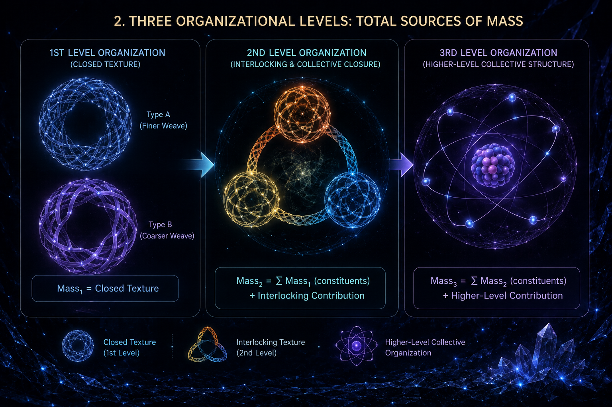

[🏠 Home](../../index.md) | [← Universe Crystal Essays](index.md)

# Universe Crystal Essay 006

## What Is Mass in Universe Crystal?

*From Organizational Magnitude to Hierarchical Mass*

Essay 005 explored how space emerges in Universe Crystal. It proposed that when multiple First-Level Organizations become mutually organized through Interlocking Texture, they can form a Collective Closure whose organizational topology provides the basis for spatiality. The three-quark organization provides the clearest current example: three First-Level Organizations become mutually organized through Interlocking Texture, forming a Second-Level Organization whose collective closure can support spatial structure.

The next question is therefore not how space emerges, but what gives an organization **mass**.

Mass is one of the most familiar physical properties of matter, yet its origin cannot simply be reduced to how much space an object occupies. In Universe Crystal, this distinction is essential because a First-Level Organization can possess internal organization without spatial extension, while a higher-level organization can acquire spatial extension through collective closure.

This leads to the central question of this essay:

**What does mass represent within the organizational structure of Universe Crystal?**

The proposal developed here is:

**Mass is a physical manifestation of the organizational magnitude incorporated into a stable organization.**

This organizational magnitude is provisionally associated with the amount and density of organized relational propagation contained within the organization. As organizations combine into higher levels, their masses can inherit contributions from lower-level organizations while also acquiring new contributions from the organization created between them.

---

# Mass as Organizational Magnitude

A Self-Closed Texture is not merely a relationship that happens to close. Its closure incorporates a structured pattern of relational propagation.

Universe Crystal proposes that the amount of organization incorporated into such a closure can be described provisionally as **Organizational Magnitude**.

One possible way to represent this magnitude is through two complementary quantities.

**Organizational Multiplicity** describes how many distinguishable relationship-propagation instances are incorporated into the organization.

**Weaving Density** describes how much organizational structure is associated with those instances.

A provisional relationship can therefore be written as:

**Organizational Magnitude ≈ Organizational Multiplicity × Weaving Density**

This is not yet a mathematical definition of mass. It is a structural proposal for what mass may correspond to within the Universe Crystal framework.

Neither quantity needs to be defined through pre-existing space. Organizational Multiplicity is not a spatial count, and Weaving Density is not mass per volume. They describe the internal organization of a closure.

Mass can therefore be understood first as an organizational property, before it is interpreted as a property of an extended physical object.

---

# Mass Is Different from Charge, Spin, and Color

This proposal preserves the distinction between mass and the organizational properties explored in earlier essays.

Charge, spin, and Color arise through specific organizational degrees of freedom and their winding or transformation structures.

Mass asks a different question.

Winding describes **how an organization is configured**.

Mass describes **how much organized structure is incorporated into the organization**.

An organization can therefore have a particular winding structure without that winding itself determining its total organizational magnitude.

This distinction is especially important for Color.

Within the current Universe Crystal interpretation, Color is not treated as something that a quark simply carries independently. Color appears when First-Level Organizations become woven into a Second-Level Organization through Interlocking Texture. The color transformations belong to the collective organization and its internal coordination.

Mass is different again. It concerns the organizational magnitude of the stable structure rather than the particular winding or color configuration through which that organization is expressed.

Thus:

**Charge, spin, and Color describe particular organizational configurations, while mass describes organizational magnitude.**

---

# Mass Across Organizational Levels

The most important test of this proposal is whether it can explain mass as organization develops through different levels.

Universe Crystal can approach this through three organizational levels.

---

## First-Level Organization: Mass from Self-Closed Organization

A First-Level Organization is established through self-closed propagation. Its identity comes from the closure itself, while its internal structure does not require spatial extension. An electron and a quark can both be considered First-Level Organizations within the current framework.

If mass is an organizational magnitude, then the mass of a First-Level Organization should originate in the organization contained within its own Self-Closed Texture.

The proposal is therefore:

**First-Level mass originates in the organizational magnitude of the First-Level Organization’s own self-closed structure.**

A First-Level Organization does not acquire its mass because it occupies a volume of space. It can possess organizational magnitude while remaining point-like in its external physical manifestation.

There is also an important implication for the large differences in mass between different types of First-Level Organizations.

If the self-closed structure of one First-Level Organization incorporates a different number of **Open Textures** from another, their organizational magnitudes may be significantly different. A closure incorporating more organized propagation may possess a greater organizational magnitude, and therefore a greater mass, than a closure incorporating less.

This provides a possible structural explanation for why different First-Level Organizations can have very different masses even though they belong to the same organizational level.

At present, however, Universe Crystal has not defined the minimum discrete unit of Open Texture. The framework should therefore not yet treat an individual Open Texture as a confirmed fundamental physical unit. Instead, a useful working hypothesis is:

**Open Texture may possess a minimum discrete organizational unit, and the mass of a First-Level Organization may be related to the number and organizational arrangement of such units incorporated into its self-closed structure.**

Under this hypothesis, different First-Level Organizations could differ in mass because their self-closed structures contain different quantities and arrangements of underlying organizational units, as well as potentially different weaving densities.

This gives a possible path from microscopic organization to the observed mass differences among elementary particles:

**Open Texture**

↓

**Discrete Organizational Units — hypothetical**

↓

**Self-Closed Texture**

↓

**Organizational Magnitude**

↓

**First-Level Mass**

This remains a structural hypothesis. Future research must determine whether a minimum discrete unit of Open Texture exists, how many such units are incorporated into different First-Level Organizations, and how their number and arrangement quantitatively map to observed mass.

---

## Second-Level Organization: Mass from Constituents and Interlocking Organization

The Second-Level Organization introduces a new source of organizational magnitude.

Three First-Level Organizations become mutually organized through Interlocking Texture and form a Collective Closure. In the current Universe Crystal framework, this provides the structural basis for a proton or neutron.

The mass of the resulting Second-Level Organization therefore has at least two contributions.

The first is the organizational magnitude already contained in the First-Level constituents.

The second is the new organizational magnitude created when those constituents become mutually organized.

Schematically:

**Second-Level Mass = Constituent Mass Contributions + Interlocking Organizational Contribution**

The second term is crucial.

Once the First-Level Organizations become interlocked, the relationships between them become part of the organization of the whole.

For the proton, the three quark organizations are therefore only part of the mass story. The proton’s mass is overwhelmingly associated with the collective QCD dynamics of confined quarks and gluons rather than with the small current masses of the three valence quarks.

The proton has a mass of about **938 MeV/c²**, while the current masses of its three valence quarks contribute only a small fraction of that amount.

This provides a strong structural correspondence with Universe Crystal:

**The mass of a Second-Level Organization can be dominated by organizational structure created between its First-Level constituents.**

Interlocking Texture is therefore not merely the mechanism that connects the three First-Level Organizations. It becomes part of the organizational content of the Second-Level Organization itself.

This is currently one of the strongest physical correspondences for the proposal that mass is a holistic organizational property.

It remains a qualitative correspondence. Universe Crystal has not yet derived the proton mass numerically or calculated the precise organizational contribution associated with its quark-gluon structure.

---

## Third-Level Organization: Mass of an Atom

The Third-Level Organization provides another important test because it allows the organizational interpretation of mass to be compared with the familiar structure of an atom.

An atom contains Second-Level Organizations in the form of protons and neutrons, together with First-Level electrons.

Its mass therefore provides a natural question:

**How is the mass of a Third-Level Organization assembled from the organizations that constitute it?**

The dominant contribution comes from the masses of the protons and neutrons, together with the much smaller contribution of the electrons. At the same time, the bound nuclear system has a different mass from the sum of its free constituents because of nuclear binding energy. Electron binding energies provide an additional but much smaller contribution to the total atomic mass.

This gives Universe Crystal a natural third-level structure:

**Third-Level Mass = Proton Contributions + Neutron Contributions + Electron Contributions + Higher-Level Binding Contributions**

The first three terms are inherited from lower organizational levels.

The final term represents organization that appears because the constituents form a higher-level collective structure.

The atom is therefore not merely a container holding several independently existing particles. The nucleus establishes collective organization among protons and neutrons, while the electrons become organized with the nucleus through electromagnetic interaction. These relationships form a higher-level organizational structure that can contribute to the total mass.

The relative size of this higher-level contribution is important. In an atom, the constituent nucleon masses dominate, while nuclear binding provides a comparatively small correction. This contrasts with the proton, where collective QCD organization dominates the mass.

This suggests that:

**The contribution of higher-level organization to mass is itself dependent on the organizational structure of the level being considered.**

Universe Crystal should therefore determine the contribution at each level rather than assume a universal proportion.

---

# A Hierarchical Picture of Mass

The three levels establish a recursive picture of mass.

### First-Level Organization

The mass of a First-Level Organization comes from the organizational magnitude of its own Self-Closed Texture.

**Mass₁ = intrinsic organizational magnitude**

### Second-Level Organization

The mass of a Second-Level Organization contains the organizational magnitude inherited from its First-Level constituents together with new organization created through Interlocking Texture and Collective Closure.

**Mass₂ = constituent magnitude + emergent collective magnitude**

### Third-Level Organization

For a Third-Level Organization such as an atom, the mass contains the inherited masses of its constituent protons, neutrons, and electrons together with additional contributions associated with higher-level collective organization and binding.

**Mass₃ = inherited lower-level mass + higher-level organizational contribution**

The central principle is therefore:

**Mass can be inherited across organizational levels while also receiving contributions from organization newly formed at each level.**

This gives the idea of mass as a holistic organizational property a concrete hierarchical meaning.

---

# From Mass to Macroscopic Organization

This hierarchical view also clarifies why gravity should not be treated as a direct particle-level explanation of mass.

At the scale of individual particles, gravitational interaction is extraordinarily weak compared with the other interactions and can usually be neglected when describing their internal organization.

Universe Crystal therefore should not expect the gravitational phenomenon to be explained directly by the internal organization of one First-Level, Second-Level, or Third-Level Organization.

The relevant question arises when organizational magnitude accumulates across enormous numbers of organizations.

First-Level Organizations form Second-Level Organizations.

Second-Level Organizations participate in Third-Level structures such as atoms.

Atoms form molecules and larger structures.

These structures form macroscopic matter, and macroscopic matter accumulates enormous amounts of organizational magnitude across many organizational levels.

At sufficiently large scales, this accumulated mass-energy becomes significant in the structure within which physical systems exist.

This brings the question back toward the relativistic relationship between mass-energy and space-time.

Universe Crystal approaches that relationship from a different ontological starting point:

**Space emerges from collective organization, while mass represents organizational magnitude within organized structures.**

The future question is therefore:

**When organizational magnitude accumulates to a sufficiently large scale, how does it participate in the structure of emergent space-time?**

The conceptual sequence becomes:

**First-Level Organization**

↓

**Second-Level Organization**

↓

**Third-Level Organization**

↓

**Higher-Level Matter**

↓

**Accumulated Organizational Magnitude**

↓

**Large-Scale Emergent Space-Time**

↓

**Gravity**

This is a research direction rather than a completed explanation of gravity.

---

# Gravity as a Later Research Problem

The present essay therefore does not attempt to derive gravity from the mass of a single particle.

It establishes a more limited starting point.

Mass can originate as organizational magnitude at each organizational level.

That magnitude can be inherited by higher-level organizations, while additional organizational contributions can emerge from the relationships among their constituents.

When enormous quantities of organized matter accumulate, the resulting organizational magnitude may become significant at the scale at which emergent space-time is expressed.

At that point, the relationship between accumulated mass and space-time becomes the central question.

Universe Crystal therefore needs a dedicated future investigation of:

**How does accumulated organizational magnitude become gravitationally significant?**

That investigation will eventually need to address the large-scale structure of space-time, the observed strength and spatial dependence of gravity, the equivalence of gravitational and inertial mass, and the relativistic behavior of matter and light.

For now, the appropriate position is:

**Gravity may be a large-scale emergent phenomenon rather than a direct property of any particular particle-level organizational closure.**

---

# The Meaning of Mass in Universe Crystal

The investigation can now be stated more precisely.

**Mass may be the physical manifestation of organizational magnitude within a stable organization.**

At the First Level, that magnitude comes from the organization’s own Self-Closed Texture.

At the Second Level, it includes the organizational magnitude inherited from the First-Level constituents together with the new organization created through Interlocking Texture and Collective Closure.

At the Third Level, represented by the atom, it includes the masses of its constituent protons, neutrons, and electrons together with additional contributions associated with nuclear and atomic binding.

At higher levels, the same principle can continue: an organization inherits organizational magnitude from its constituents while potentially generating additional magnitude through the relationships that organize the whole.

The proton and atom provide two different examples of this hierarchy. In the proton, collective QCD organization dominates the mass. In the atom, the masses of the constituent nucleons dominate, while higher-level binding contributes a smaller correction.

Together, these examples support a more specific interpretation of mass as a **hierarchical organizational property**.

---

# Open Research Program

The next step is to turn this structural interpretation into a quantitative theory.

For First-Level Organizations, Universe Crystal must determine what specific features of Self-Closed Texture establish Organizational Magnitude and how that magnitude produces the observed masses of elementary particles. It must also investigate whether Open Texture possesses a minimum discrete organizational unit and whether differences in the number and arrangement of such units can account for the large mass differences among First-Level Organizations.

For Second-Level Organizations, it must determine how the organizational magnitude of Interlocking Texture contributes to the total mass of structures such as protons and neutrons.

For Third-Level Organizations, it must determine how constituent masses and higher-level binding organization combine to produce atomic masses.

Beyond the Third Level, the same question must be extended to molecules, condensed matter, macroscopic objects, and ultimately large-scale matter distributions.

Only after this hierarchy is understood can the next question be addressed with sufficient precision:

**How does accumulated organizational magnitude become a source of the large-scale space-time structure that we observe as gravity?**

That is a separate research problem.

For Essay 006, the central conclusion is therefore:

**Mass in Universe Crystal is proposed to be the physical manifestation of organizational magnitude, inherited across organizational levels and potentially augmented by the new organization created at each higher level.**

The task ahead is to determine whether this organizational magnitude can be defined mathematically, whether it can reproduce the observed mass spectrum and binding contributions across organizational levels, and whether its large-scale accumulation can ultimately connect the organizational structure of matter with the emergent structure of space-time.

**Read and comment on Medium:**

[What Is Mass in Universe Crystal?](https://medium.com/@jerry.jiangheng/universe-crystal-essay-006-what-is-mass-in-universe-crystal-c9a4737af3c1)
---

[← Essay 005](essay-005.md) | [Universe Crystal Essays](index.md) |  [Essay 007 →](essay-007.md)