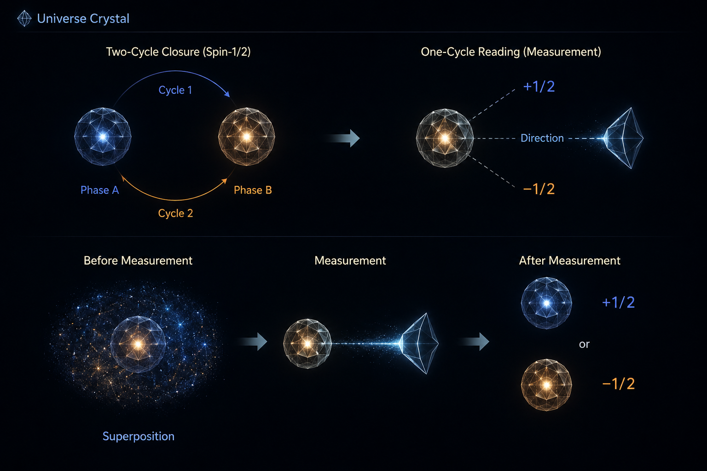

[🏠 Home](../../index.md) | [← Universe Crystal Essays](index.md)

# Universe Crystal Essay 007

## What Is Spin and Quantum Superposition in Universe Crystal?

*Two-Cycle Closure and One-Cycle Reading: The Organizational Origin of Quantum Superposition*

## Introduction

In Universe Crystal, spin is not treated as a classical property that a particle simply possesses, nor as a small object physically rotating around a pre-existing axis. Spin is understood as a manifestation of organizational weaving and its coupling with emergent spatial organization.

This leads to two related questions:

**What is spin in Universe Crystal?**

and:

**What is quantum superposition from the Universe Crystal Ground View?**

The first question concerns the organization itself. The second concerns what happens when that organization is read.

The central proposal developed in this essay is that a spin-() organization may have a **two-cycle closure structure**: its complete organizational closure requires two cycles of its weaving structure. A measurement, however, is an interaction between organizations and may establish only a **one-cycle reading**.

If so, a single-cycle reading cannot read the complete closure of a two-cycle organization. It can read only one of its two complementary phases.

This provides a possible organizational origin for the two outcomes conventionally represented as (+) and (-), and suggests a new interpretation of quantum superposition:

**Quantum superposition may be the classical measurement language used to describe an organizational state whose complete closure extends beyond a single reading cycle.**

The purpose of this essay is not to replace quantum mechanics with this proposal. It is to investigate whether a deeper organizational picture can make the observed quantum behavior natural from the Ground View of Universe Crystal.

---

## Spin as Organizational Weaving

A particle is not fundamentally understood in Universe Crystal as a small classical object carrying a collection of independent properties.

Its identity arises from organization, and its properties can be understood as manifestations of that organization and its relations with other organizations.

Spin therefore should not initially be imagined as a classical object rotating around an axis.

Instead:

**Spin is a manifestation of the weaving structure of an organization through its coupling with spatial organization.**

This distinction matters because a classical direction already assumes a coordinate system.

A classical spinning object can be described as rotating around an axis because the axis is defined within an external spatial framework.

The organization considered in the Universe Crystal Ground View does not need to begin with such an externally imposed coordinate system.

Its internal weaving exists first.

A particular spatial direction becomes relevant when another organization interacts with it through a reading relationship.

---

## Measurement as Organizational Reading

Measurement is therefore not an act performed by an external observer standing outside the physical system.

The measuring system is itself an organization.

The measured system is another organization.

Measurement is consequently a form of **organizational reading**:

**Reading Organization**

↕

**Measured Organization**

For a reading to occur, the two organizations must couple.

The coupling establishes the relational configuration through which the measured organization becomes readable.

This means that the measured organization does not need to carry a pre-existing classical (x), (y), or (z) axis.

Instead:

**Measured Organization**

→ **Coupling with Reading Organization**

→ **Relational Direction**

→ **Organizational Reading**

→ **Observable Manifestation**

The direction used in a spin measurement therefore belongs to the reading relationship.

It is not necessarily an intrinsic classical coordinate carried by the measured organization.

This distinction becomes essential when interpreting (+) and (-).

---

## What Does a Spin Measurement Actually Return?

A spin measurement does not report that the particle was previously pointing in one classical direction.

It returns a manifestation of the organization’s weaving structure relative to the direction established by the reading relationship.

Thus:

[ + ]

and

[ - ]

should not initially be interpreted as two classical orientations hidden inside the particle.

They are two possible results of reading the same organization through a particular relational direction.

The important question is therefore:

**Why does this reading produce two results?**

The answer proposed here comes from the relationship between **organizational closure cycles** and the **reading cycle**.

---

## Closure Is Cyclic Organization

A closed organization may require more than one cycle of its weaving structure to return to its complete configuration.

This introduces a distinction between organizations with different closure cycles.

A **single-cycle organization** completes its closure within one cycle.

A **two-cycle organization** requires two cycles to complete its full closure.

The relevant cycles here are organizational cycles, not classical rotations through an externally defined coordinate system.

The question is therefore not:

“How many times does a particle physically rotate?”

but:

**“How many organizational cycles are required for the weaving structure to return to its complete closed configuration?”**

The working hypothesis of this essay is that the organization associated with spin-() has a two-cycle closure structure.

Its complete closure requires two cycles.

---

## Single-Cycle Closure: One Phase, One Reading Result

Consider first a single-cycle organization.

If one cycle is sufficient to complete its closure, then one cycle corresponds to one complete organizational phase.

If a reading organization establishes a one-cycle coupling with that organization, the reading can encounter the complete phase.

The relationship is therefore:

**One-Cycle Closure**

→ **One Complete Phase**

→ **One-Cycle Reading**

→ **One Reading Result**

The organization returns to its complete configuration within the same cycle through which it is read.

There is therefore no structural reason for two distinct phase results to appear under the same reading relationship.

---

## Two-Cycle Closure: Two Phases, Two Reading Results

Now consider a two-cycle organization.

Its complete closure requires two cycles.

The full organizational structure therefore contains two complementary phases within its closure cycle.

A reading interaction, however, establishes a one-cycle coupling.

The reading cannot cover the complete two-cycle closure.

It reads one phase of the organization.

The structure can therefore be represented as:

**Two-Cycle Closure**

→ **Phase A**

→ **Phase B**

→ **Complete Closure**

A one-cycle reading can encounter either:

**Phase A**

or

**Phase B**.

The two possible measurement outcomes therefore arise from the relationship between the organization’s closure structure and the reading cycle.

They do not need to be introduced as an independent measurement rule.

---

## The Reading Returns a Phase, Not Half a Particle

The one-cycle reading should not be understood as reading half of a particle.

What is being read is a **phase of the organizational weaving**.

A two-cycle organization contains two complementary phases within its complete closure structure.

A one-cycle reading accesses one of them.

For spin-(), conventional measurement language represents these two manifestations as:

[ + ]

and

[ - ]

The Universe Crystal interpretation proposed here is that these are not two different underlying organizations.

They are two complementary phase manifestations of the same two-cycle organizational structure under a one-cycle reading.

Thus the two results belong to the reading relationship rather than representing two independent classical states hidden inside the particle.

---

## Why the Measurement Direction Can Be Arbitrary

Because the measured organization does not need to carry a pre-existing classical coordinate axis, a measurement direction can be established through the coupling between the reading organization and the measured organization.

Changing the measurement direction therefore changes the relational configuration of the reading.

It does not require the particle to contain a hidden classical arrow that must physically rotate into alignment with the measuring apparatus.

The structure is instead:

**Reading Organization**

↕

**Measured Organization**

→ **Relational Direction**

→ **Reading of Organizational Weaving**

→ **Phase Manifestation**

The same organization can therefore be read through different directions without assuming that it possesses a classical spatial axis of its own.

---

## Why the Two Outcomes Are Natural for Spin-()

The proposed relationship can now be stated simply.

For a single-cycle organization:

**One cycle**

→ **One complete phase**

→ **One-cycle reading**

→ **One result**

For a two-cycle organization:

**Two cycles**

→ **Two complementary phases**

→ **One-cycle reading**

→ **Two possible results**

For spin-(), those two conventional results are:

[ +,- ]

The important point is that the two-outcome structure is not being introduced as a separate assumption.

It follows, provisionally, from the mismatch between:

**the organization’s two-cycle closure**

and

**the measurement’s one-cycle reading.**

This gives a possible organizational explanation for why spin-() has two measurement outcomes along any chosen direction.

---

## From Two-Cycle Closure to Quantum Superposition

This is where the interpretation moves beyond spin measurement.

In conventional quantum language, a spin-() system can be described before measurement as being in a superposition of possible measurement outcomes.

Universe Crystal asks what this language may correspond to at the organizational level.

The measured organization exists with its complete weaving structure before a particular reading relationship is established.

It does not need to possess a classical coordinate axis corresponding to the measurement direction.

When a reading organization couples with it, a relational direction is established.

The reading then covers one organizational cycle.

For a two-cycle organization, that one-cycle reading encounters one of two complementary phases.

The conventional language of superposition may therefore be understood as a description of the organization before a particular phase manifestation has been determined through a specific reading relationship.

This leads to the central proposition:

**Quantum superposition may be a classical measurement-language representation of an organizational state whose complete closure extends beyond a single measurement cycle.**

In this interpretation, superposition does not mean that a classical object literally contains two classical states at the same time.

The underlying organization has one complete organizational structure.

What has not yet been established is which phase manifestation will be returned by a particular reading relationship.

---

## Superposition Is Not Simply Ignorance

This distinction separates the proposal from a simple hidden-state interpretation.

If superposition were merely ignorance, the organization would already possess a definite classical answer for every possible measurement direction, and measurement would simply reveal an answer that had existed beforehand.

Universe Crystal does not require such a picture.

The organization does not need to possess a pre-existing classical measurement axis.

A particular measurement direction exists as part of a particular organizational coupling.

The question is therefore not:

“Which classical answer was already hidden inside the particle?”

It is:

**“Which organizational phase does this structure manifest when it is read through this particular relational coupling?”**

The measurement does not simply uncover a hidden classical orientation.

It establishes a relational context through which one of the organization’s possible phase manifestations becomes determinate.

This provides a possible Ground View interpretation of why quantum superposition differs fundamentally from ordinary classical uncertainty.

---

## Superposition as a Measurement Language

From this perspective, the conventional word **superposition** may itself be part of a measurement-centered language.

Quantum mechanics describes possible measurement outcomes mathematically.

Universe Crystal asks what organizational condition could lie beneath that description.

The explanatory order is therefore reversed.

Instead of beginning with:

**Superposition**

→ **Measurement**

Universe Crystal begins with:

**Organization**

→ **Closure Cycle**

→ **Phase**

→ **Organizational Coupling**

→ **Reading**

→ **Measurement Manifestation**

The superposition description may then emerge as a way of expressing the organizational state before a particular reading relationship determines one of its phase manifestations.

This is the deeper conceptual claim of this essay.

---

## Spin and the Minimum Sufficient Organization

The magnitude (1/2) can also be connected to the Minimum Sufficient Organization principle.

A First-Level Organization requires enough coupling to spatial organization to support meaningful spatial arrangement and exchange with other organizations.

The smallest non-trivial organizational structure capable of providing this coupling is proposed to be the spin-() structure.

Its two-cycle closure provides the minimum organizational structure required for this type of spatial coupling.

There is therefore no need to introduce (3/2), (5/2), or higher half-integer structures as the minimum organization.

Spin-() already provides the required organizational coupling.

The magnitude of spin and its two-outcome measurement structure therefore have a common proposed foundation:

**The minimum sufficient organization is a two-cycle organization.**

---

## Second-Level Organization: Why the Proton Still Requires Further Research

Protons and neutrons are Second-Level Organizations built from three First-Level Organizations, and both have measured spin (1/2).

It would be tempting to assume that their spin is simply obtained by combining three spin-() constituents.

The physical situation is more complex.

The measured spin of the proton is not accounted for simply by the intrinsic spins of its constituent quarks. Gluon spin and orbital angular momentum of quarks and gluons also contribute to the proton’s total angular momentum.

For Universe Crystal, the correct position is therefore cautious.

The collective organization of the proton evidently produces a spin-() manifestation, but the mechanism by which a Second-Level Organization produces that value has not yet been derived.

Interlocking Texture may eventually be relevant because it has been proposed to carry organizational content within composite structures, including the internal coordination associated with color organization.

At present, however, this remains an open research question.

The framework should therefore not claim that the proton’s (1/2) has already been derived from the organization of its constituents.

---

## Third-Level Organization: Spin Is Not Simply 0 or 1

Atomic organization requires another correction.

Atoms do not universally have total spin 0 or 1.

An atom’s total spin depends on its particular internal configuration and can be integer or half-integer.

Hydrogen, for example, has an electron with spin (1/2), while different atomic configurations can produce different total spins.

A more general pattern is associated with the parity of the number of half-integer-spin constituents.

Even numbers of fermionic half-integer contributions can combine into integer total spin, while odd numbers can produce half-integer total spin.

This provides an important constraint for Universe Crystal:

**Nested organization should preserve the even-or-odd structure underlying integer versus half-integer total spin.**

The mechanism by which this parity structure emerges from the deeper organizational framework has not yet been derived.

It should therefore be treated as an established physical constraint that future Universe Crystal theory must account for, rather than as an explanation already completed by the framework.

---

## The Emerging Ground View

The central organizational chain proposed in this essay is:

**Organizational Weaving**

↓

**Closure Cycle**

↓

**Organizational Phase**

↓

**Coupling with Reading Organization**

↓

**Relational Measurement Direction**

↓

**Phase Reading**

↓

**Discrete Manifestation**

For a single-cycle organization:

**one cycle → one phase → one result**

For a two-cycle organization:

**two cycles → two complementary phases → one-cycle reading → two possible results**

For spin-():

[ +  - ]

The significance of this chain is that the measurement result is no longer the starting point of the explanation.

The organizational structure is the starting point.

Measurement becomes a way in which that structure manifests through a specific relational coupling.

---

## A Preliminary Universe Crystal Interpretation of Quantum Superposition

The central proposal can now be stated directly:

**Quantum superposition may be the classical measurement language used to describe an organizational state whose complete closure contains multiple phases that cannot be fully expressed through a single measurement cycle.**

For spin-(), the organization is provisionally understood as a two-cycle closure structure.

Before a particular reading relationship is established, no external classical measurement direction needs to be assigned to the organization.

When the reading organization couples with it, a relational direction is established.

A one-cycle reading then encounters one of the two complementary phases.

The conventional quantum description expresses the pre-reading condition through superposition and the reading condition through one of the two allowed outcomes.

Universe Crystal therefore changes the explanatory order:

**Quantum Language**

→ describes the measurement possibilities.

**Universe Crystal Ground View**

→ asks what organizational structure makes those possibilities natural.

The proposed answer is:

**Multi-cycle organizational closure combined with finite-cycle organizational reading.**

---

## Where This Leaves the Research

This essay establishes a new conceptual connection among several Universe Crystal ideas:

**Organization**

→ **Weaving**

→ **Closure**

→ **Phase**

→ **Reading**

→ **Measurement**

→ **Spin**

→ **Quantum Superposition**

The central hypothesis is that the multiplicity represented by quantum states does not necessarily mean that a classical object literally contains multiple classical configurations simultaneously.

It may instead arise because the complete organizational structure contains more phase structure than a single measurement cycle can express.

For a single-cycle organization, one reading cycle can recover one complete phase.

For a two-cycle organization, one reading cycle encounters one of two complementary phases.

This provides a possible Ground View explanation for the two measurement outcomes of spin-(), and a possible ontological interpretation of the quantum language of superposition.

This remains an exploratory hypothesis.

A complete Universe Crystal theory would need to determine the internal structure of the proposed two-cycle organization, explain why its phase manifestations correspond quantitatively to (+) and (-), and reproduce the established quantitative predictions of quantum mechanics.

The conceptual result is nevertheless clear:

**Spin can be understood as a manifestation of organizational weaving; measurement can be understood as organizational reading; and quantum superposition may be the classical measurement language for an organization whose complete closure extends beyond a single reading cycle.**

**Read and comment on Medium:**

[What Is Spin and Quantum Superposition in Universe Crystal?](https://medium.com/@jerry.jiangheng/universe-crystal-essay-007-what-is-spin-and-quantum-superposition-in-universe-crystal-17eeec285f85)

[← Essay 006](essay-006.md) | [Universe Crystal Essays](index.md)