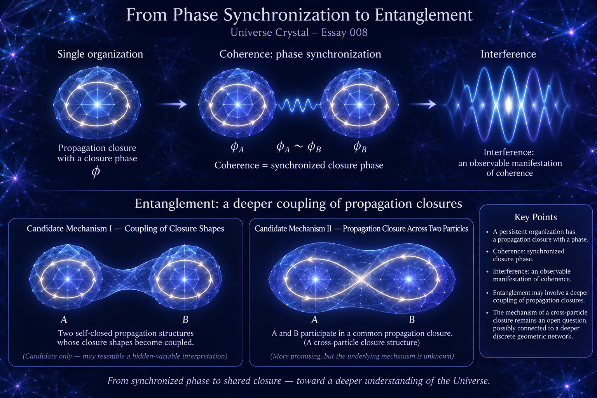

[🏠 Home](../../index.md) | [← Universe Crystal Essays](index.md)

# Universe Crystal Essay 008

## Universe Crystal essay 008 — From Phase Synchronization to Entanglement

*Coherence as Synchronized Closure Phase and Entanglement as a Candidate Coupling of Propagation Closures*

## Abstract

Previous research on spin and measurement has led to a more specific interpretation of coherence. A persistent organization has its own propagation closure and an associated closure phase. When the closure phases of two organizations are synchronized, the organizations are coherent. Coherence can therefore be understood, within Universe Crystal, as a state of phase synchronization between propagation closures. Interference may then be understood as an observable manifestation of such maintained phase relations.

Entanglement appears to require something beyond coherence. Two particles may each retain their own propagation closure while their closure phases remain synchronized, but entanglement may involve a deeper coupling of the closure relationships themselves. This essay records two candidate interpretations. The first is that the closure structures of two otherwise self-closed organizations become coupled in their structural form. The second is that the propagation closure itself extends across the two particles, forming a common closure structure. The first possibility is retained only as a candidate because a pre-existing coupling of closure shapes could potentially resemble a hidden-variable interpretation. The second possibility is therefore considered more promising, although its underlying mechanism remains unknown.

The purpose of this essay is not to provide a completed explanation of entanglement, but to distinguish coherence from entanglement and identify the deeper questions that entanglement raises for Universe Crystal.

---

## 1. From a Single Organization to Two Organizations

Previous research has focused primarily on a single organization.

A particle or composite particle can be understood as a persistent organization formed through relational propagation and closure. Closure does not necessarily mean that something travels around a circle in ordinary space. It refers to the continued propagation of relations forming a self-consistent organization, allowing that organization to persist.

Such a propagation closure has a phase.

This provides a starting point for the earlier proposal concerning spin (1/2): spin (1/2) may be understood as a two-cycle closure, while measurement corresponds to a single-cycle reading. This interpretation remains under investigation, but it provides a basis for considering what happens when two organizations are involved.

The question then becomes:

**What does it mean for two persistent organizations to be coherent?**

---

## 2. Coherence: Phase Synchronization of Propagation Closures

Each organization has its own propagation closure and its own closure phase.

Consider two organizations, A and B.

A has:

propagation closure + phase (\phi_A)

B has:

propagation closure + phase (\phi_B)

When the closure phases of the two organizations are in a synchronized relationship,

\[
\phi_A \sim \phi_B
\]

the organizations are described as **coherent**.

Coherence does not mean that the two organizations lose their individual propagation closures. A continues to have its own propagation closure, and B continues to have its own propagation closure. What they share is a **synchronized phase relationship**.

Therefore, within the Universe Crystal framework, coherence can provisionally be understood as:

**Coherence is the state in which the phases of two organizations' propagation closures remain synchronized.**

The mechanism by which such synchronization is established is a separate question and is not assumed here.

---

## 3. Interference as an Observable Manifestation of Coherence

When a phase relationship is maintained, different propagation states can contribute to an observable pattern while preserving their phase relationship.

This provides a possible organizational interpretation of interference.

The underlying organizational condition is:

**phase synchronization**

The observable manifestation is:

**interference**

A provisional conceptual chain is therefore:

**propagation closure → phase → phase synchronization → coherence → interference**

From this perspective, decoherence can also be described in a simple way.

When an interaction with another organization disrupts the phase relationship, the original synchronization is lost or reorganized. The coherent relationship is thereby destroyed, and the corresponding interference behavior is affected.

Thus:

**Decoherence can provisionally be understood as the loss of phase synchronization.**

This interpretation still requires further quantitative investigation, but it provides a continuous conceptual connection between organization, phase, coherence, and interference.

---

## 4. Why Entanglement Is Different from Coherence

Entanglement appears to require something deeper than phase synchronization.

Two organizations can retain their individual propagation closures while their closure phases remain synchronized.

For example:

A retains its own propagation closure.  
B retains its own propagation closure.  
Their closure phases remain synchronized.

This describes coherence.

Entanglement, however, appears to raise another question:

**Can the propagation closure relationships of the two organizations themselves become coupled?**

If so, entanglement would not simply mean that two organizations have synchronized phases. It would mean that the closure relationships underlying the two organizations have entered a deeper organizational relationship.

The distinction can therefore provisionally be stated as:

**Coherence concerns synchronization of closure phase.**

**Entanglement may involve coupling of propagation closures themselves.**

This is a candidate interpretation, not yet a completed theoretical definition.

---

## 5. Candidate Mechanism I — Coupling of Closure Shapes

The first possibility is that the two particles retain their own propagation closures, while the **shapes of those closures become coupled**.

In this picture:

A retains its own closure.  
B retains its own closure.  
Their closure structures become coupled.

If such a coupling, once established, could persist, then the relationship might remain even after the particles became spatially separated, provided that measurement or environmental interaction did not disrupt it.

This interpretation has the advantage of preserving the individual propagation closures and identities of the two particles.

However, it raises an important theoretical concern.

If the coupled closure shapes were assumed to contain predetermined information about how each particle would respond to different measurement settings, the interpretation could begin to resemble a hidden-variable picture.

For this reason, this mechanism is currently retained only as a candidate.

It is recorded here as a possibility:

**The individual propagation closures of two particles may become coupled through their closure structures.**

It is not adopted as the explanation of entanglement.

---

## 6. Candidate Mechanism II — Propagation Closure Across Two Particles

The second possibility is more fundamental.

Instead of two independent closures whose shapes become coupled, the propagation closure itself may extend across the two particles.

In this interpretation:

**A and B participate in a larger common closure structure.**

The word “across” must not be understood as something physically traveling through ordinary space from A to B and then returning to A.

Closure in Universe Crystal is not defined as an object physically traveling around a spatial loop.

Rather, the proposal is that:

**the relational propagation structure itself may include both particles and form a common closure relationship.**

The two particles could therefore remain spatially separated while participating in a deeper common organizational closure.

This has a conceptual resemblance to the fact that an entangled quantum system is described by a joint quantum state rather than by two completely independent states. However, the two descriptions should not be identified. A shared quantum state is an established mathematical description in quantum mechanics; a cross-particle propagation closure is a proposed ontological interpretation within Universe Crystal.

---

## 7. This Raises a Deeper Question: What Is Distance?

If two entangled particles can become widely separated in ordinary space while their common organizational relationship remains intact, another fundamental question emerges:

**Is spatial distance a fundamental measure of every organizational relationship?**

At the ordinary spatial level:

A and B may be very far apart.

At a deeper organizational level:

A and B may remain directly connected.

This does not mean that the two particles have no spatial distance.

Rather, it raises the possibility that:

**spatial distance may be an emergent property of a deeper organizational structure, while some fundamental organizational relationships may not use spatial distance as their basic measure.**

If this possibility is correct, entanglement may provide a clue not only about quantum organization, but also about the nature of distance itself.

This question may ultimately require research into a deeper discrete geometric network underlying organized particles and ordinary spatial structure.

---

## 8. Measurement and the Disruption of Entanglement

Previous research on measurement provides another important connection.

Measurement is not treated as a completely passive observation.

A measurement organization establishes a specific coupling with the propagation closure of the measured particle. This interaction can leave a persistent phase relation within the organization.

For a single organization, such an interaction can change its state.

For coherent organizations, it can disrupt the existing phase synchronization.

For an entangled organization, if entanglement indeed corresponds to a common propagation closure, measurement may further alter or disrupt that common closure relationship.

A provisional sequence is therefore:

**entangled organization**

→ measurement interaction

→ change in the closure relationship

→ disruption of the original joint organization

→ disentanglement / decoherence

This remains a hypothesis. The precise mechanism is not yet known.

---

## 9. What Can Currently Be Claimed

At this stage, the research can remain at a relatively clear level.

A persistent organization has a propagation closure.

The propagation closure has a phase.

Two organizations can have synchronized closure phases.

This provides a candidate organizational interpretation of **coherence**.

Maintained coherence can produce observable phenomena such as **interference**.

Entanglement appears to involve something beyond simple phase synchronization.

One candidate interpretation is:

**The propagation closure relationships of two particles become coupled.**

Two possible forms have been identified:

1. The **shapes of two otherwise self-closed propagation structures become coupled**.
2. The **propagation closure itself extends across the two particles**, forming a common closure structure.

The first possibility is retained as a candidate, but requires caution because a predetermined coupling of closure shapes could potentially resemble a hidden-variable interpretation.

The second possibility appears more promising, but its underlying mechanism remains unknown.

Most importantly:

**We do not yet know what underlying structure could support such a cross-particle closure.**

It may require a deeper level of Universe Crystal than the organizational and texture concepts developed so far.

---

## 10. The Next Research Question

The current conceptual structure can therefore be expressed through two branches.

**First branch:**

**propagation closure**  
→ **closure phase**  
→ **phase synchronization**  
→ **coherence**  
→ **interference**

**Second branch:**

**propagation closure**  
→ **coupling of closure relationships**  
→ **entanglement**

The first branch provides a preliminary path connecting organization, phase, coherence, and interference.

The second branch exposes a deeper problem:

**If entanglement corresponds to a common closure extending across two particles, what deeper structure can support such a closure without requiring an ordinary propagation process between them?**

This question may exceed the explanatory scope of the current organization and texture framework and may require investigation of the deeper discrete geometric network of Universe Crystal.

The current conclusion should therefore remain modest:

**Coherence can provisionally be understood as synchronized closure phase, while entanglement may involve a deeper coupling of propagation closures.**

This distinction is recorded as a research hypothesis rather than a completed theoretical explanation.

**Read and comment on Medium:**

[From Phase Synchronization to Entanglement](https://medium.com/@jerry.jiangheng/universe-crystal-essay-008-from-phase-synchronization-to-entanglement-f55e0a4551ef?sharedUserId=jerry.jiangheng)

[← Essay 007](essay-007.md) | [Universe Crystal Essays](index.md)