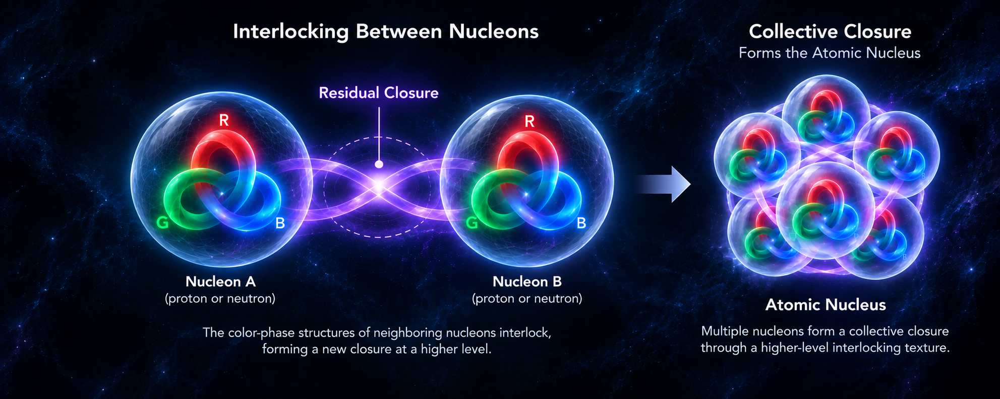

[🏠 Home](../../index.md) | [← Universe Crystal Essays](index.md)

# Universe Crystal Essay 009

## Universe Crystal essay 009 — How Residual Closure in Interlocking Texture Forms the Atomic Nucleus

Essay 003 proposed that color charge can be understood as a relational phase of Second-Level Weaving. Once First-Level Organizations have formed, they themselves become the elements of a higher-order weaving process. Within that process, color describes the relational phase of the participating organizations, while Interlocking Texture provides the structure through which their color-phase changes remain coordinated.
The next step follows naturally from this picture.
If color is a relational phase of Second-Level Weaving, and Interlocking Texture coordinates the phases of participating First-Level Organizations, then what happens when this higher-order weaving reaches closure?
Essay 003 gives us the beginning of the answer.
Three First-Level Organizations can participate in a coordinated color-phase structure:
R → G → B → R
The phase relations return to themselves, producing a higher-order closure.
At the level of particle organization, this gives us a way to understand the formation of a proton or neutron as a closed color-phase organization.
But once such a closure has formed, the organizational process has reached a new level.
The three participating First-Level Organizations have become one higher-order organization.
And this new organization can itself participate in another relation.
This is where the next layer of Universe Crystal begins to appear.
A proton is already an organized closure.
A neutron is already an organized closure.
When two such organizations become neighbors, the relation between them becomes a new object of organization.
The same principle that previously operated between First-Level Organizations can therefore operate again between already-formed higher-order organizations.
The structure becomes:
First-Level Organizations
→ Second-Level Weaving
→ Color Phase
→ Interlocking Texture
→ Closure
→ Nucleon
and then:
Nucleon
→ New Interlocking Texture
→ New Closure
This second interlocking is the key to understanding Residual Closure.
The important transition is from organization to organization.
Once a nucleon has formed, its internal color-phase relations remain organized within its own closure. When another nucleon enters a sufficiently close spatial relationship, the two organizations become capable of participating in a new relational structure.
Their existing organizations now provide the elements of a higher-level weaving.
The relation can therefore be expressed as:
Nucleon A ↔ Nucleon B
A new Interlocking Texture emerges between them.
This is a new organizational layer built from already organized structures.
The same logic can then continue.
A third nucleon can participate in the relation.
Then a fourth.
Then many more.
The relational structure expands from:
A ↔ B
to:
A ↔ B ↔ C ↔ D ↔ …
At a certain organizational scale, these relations can form a collective closure.
That collective closure is the atomic nucleus.
The formation of the nucleus can therefore be expressed as a continuous extension of the organization already established at the nucleon level:
Color Phase
→ Interlocking Texture
→ Color-Phase Coordination
→ Second-Level Closure
→ Nucleon
→ Re-Interlocking
→ Residual Closure
→ Collective Nuclear Organization
The meaning of “Residual Closure” emerges directly from this sequence.
A closure creates an organization.
That organization becomes an element of a new relational structure.
The new relational structure produces a new Interlocking Texture.
The new Interlocking Texture can itself reach closure.
Residual Closure therefore describes the new closure generated through the continued interlocking of already-formed organizations.
This gives the word “residual” a structural meaning. The organizational capacity established at one level becomes part of the conditions through which a higher level can organize.
The first closure produces the nucleon.
The nucleon then participates in a second interlocking.
The second interlocking produces a higher-order closure.
The atomic nucleus is the resulting collective organization.
Seen in this way, the residual strong interaction becomes naturally connected to the same organizational principle that produced the strong interaction at the quark level.
At the quark level, color-phase relations participate in Interlocking Texture and form a closed higher-order organization.
At the nucleon level, already-formed closures participate in a new Interlocking Texture and form another closure.
The organizational sequence therefore continues:
Interlocking → Closure → Organization → Re-Interlocking → New Closure
The nucleus is a higher-level organization generated through this recursive structure.
This also gives us a way to understand why the nuclear interaction has a limited spatial range.
For a new interlocking to emerge, the participating organizations must enter a spatial configuration in which their relational structures can become mutually accessible.
A nucleon carries its own closed color-phase organization.
When another nucleon is sufficiently close, the two organizations can participate in a new relational structure.
Thus:
Spatial Proximity
→ Relational Accessibility
→ Phase Coupling
→ New Interlocking Texture
→ Residual Closure
The spatial range therefore belongs to the condition for forming the new organization.
Distance determines whether the relevant organizations can enter the required relational configuration.
The same picture also leads naturally to a question about nuclear composition.
If nuclei emerge through collective closure, then the number and proportion of participating nucleons must depend on the conditions required for that collective organization.
Protons and neutrons both participate in nuclear interlocking.
At the same time, protons carry positive electric charge. As the number of protons increases, proton-proton electromagnetic repulsion becomes an increasingly important part of the total relational structure.
Neutrons participate in the nuclear organization without introducing another positive electric charge.
Consequently, the compositional conditions for collective closure change as the size of the nucleus increases.
For light stable nuclei, proton and neutron numbers are often relatively close:
N ≈ Z
As the nucleus becomes larger, the increasing proton-proton electromagnetic repulsion shifts the stable region toward a greater proportion of neutrons:
N > Z
For many heavier stable nuclei, the neutron-to-proton ratio reaches roughly the order of:
N ≈ 1.5Z
This is a broad trend rather than a fixed universal ratio.
From the Universe Crystal perspective, the important point is the organizational progression behind this trend:
Larger Organization
→ More Participating Nucleons
→ More Complex Relational Structure
→ Changing Closure Conditions
→ Changing Proton-Neutron Composition
The composition of the nucleus therefore becomes part of the collective closure itself.
The nucleus is consequently not simply a collection of nucleons.
It is a new organizational level whose structure emerges from the relations among nucleons.
This brings the entire picture back to the central principle of Universe Crystal.
Essay 003 showed that color charge can be understood as a relational phase appearing when already-formed organizations participate in Second-Level Weaving.
The present step follows that organization one level further.
The color-phase organization of First-Level Organizations produces a closed nucleon structure.
That nucleon then becomes an organized participant in a new relation.
The new relation creates a new Interlocking Texture.
The new Interlocking Texture reaches a new closure.
And multiple nucleons can participate in this process collectively.
Thus:
Color Phase
→ Second-Level Weaving
→ Interlocking Texture
→ Closure
→ Nucleon
→ New Interlocking Texture
→ Residual Closure
→ Collective Closure
→ Atomic Nucleus
The important discovery is therefore the continuity of the organizational principle.
A higher-level organization does not end the possibility of further organization.
Once an organization has formed, it becomes a new element through which relational structure can continue to develop.
Closure creates organization.
Organization enters new relations.
New relations form new Interlocking Texture.
Interlocking Texture generates new closure.
And new closure produces a higher-level organization.
The atomic nucleus can therefore be understood as a natural continuation of the same generative principle already revealed in the formation of the nucleon:
Interlocking Texture → Closure → Organization → Re-Interlocking → Residual Closure → Higher-Level Organization
From color phase to nucleon, and from nucleon to nucleus, the Universe Crystal framework thus traces a continuous path of organizational emergence.

**Read and comment on Medium:**

[How Residual Closure in Interlocking Texture Forms the Atomic Nucleus](https://medium.com/@jerry.jiangheng/universe-crystal-essay-009-how-residual-closure-in-interlocking-texture-forms-the-atomic-nucleus-28f4bcda7aaa?sharedUserId=jerry.jiangheng）

[← Essay 008](essay-008.md) | [Universe Crystal Essays](index.md)  [Essay 010 →](essay-010.md)