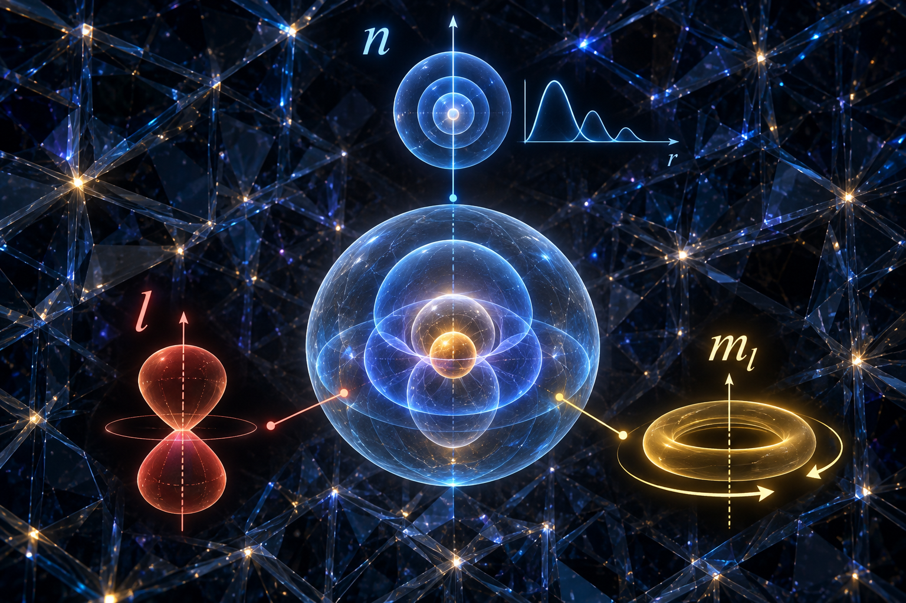

[🏠 Home](../../index.md) | [← Universe Crystal Essays](index.md)

# Universe Crystal Essay 010

## Universe Crystal essay 010 — How Electron Re-Propagation Forms the Atom
*Closure and the Emergence of Discrete Cloud Propagation Modes*

# Abstract

Essay 009 examined how Residual Closure
within Interlocking Texture forms the atomic nucleus. Essay 010 continues the
same higher-level emergence question: how does an already formed atomic nucleus
interact with an already existing electron organization to form the atom? This
essay proposes that the key process is not simply that an electron becomes
“bound” to the nucleus, but that the electron undergoes Re-Propagation within a
new nucleus–electron relational context. The organization of the nucleus constrains
and reorganizes electron propagation, transforming open propagation into Cloud
Propagation. Cloud Propagation possesses radial, angular, and azimuthal
structural degrees of freedom. Each degree of freedom is subject to a distinct
form of Closure, and these Closure conditions restrict continuous propagation
possibilities to discrete, self-consistent modes represented by n, l, and m_l.

The essay also addresses a central
question: why do some orbital modes have angular structure while the simplest
mode does not? The simplest Cloud Propagation can remain spherically symmetric,
corresponding to l=0 and the s mode. As an atom accommodates more electrons,
additional distinguishable propagation modes are required, and angular degrees
of freedom become structurally important. At the same time, photons carry
angular momentum, so electron absorption and emission processes require
angular-momentum exchange. This gives angular structure a direct physical role
in electronic transitions. From the Universe Crystal perspective, s, p, d, and
f can therefore be interpreted as different orders of angular organization
emerging within Cloud Propagation, rather than as merely pre-existing orbital
shapes.

# 1. From the Atomic Nucleus to the Atom

Essay 009 established the atomic nucleus as
a higher-level organization: interlocking propagation among quarks produces
Residual Closure, and Residual Closure forms a new nuclear organization. Essay
010 addresses the next step: once the nucleus exists, how does the atom emerge?

**Interlocking Texture → Residual Closure → Atomic
Nucleus**

**Atomic Nucleus + Electron Propagation → Re-Propagation
→ Closure → Atom**

The organizational level has now changed.
The electron already exists as an organization, and the atomic nucleus already
exists as a higher-level organization. When the electron enters a new relation
with the nucleus, its propagation is reorganized within that new context. This
process is called Re-Propagation.

The atom is therefore not simply a
collection of a nucleus and an electron. It is a new organization produced when
two existing organizations enter a new relational context and generate a new,
self-consistent propagation organization.

# 2. The Electron Before Re-Propagation

Outside a bound atomic organization, an
electron can be described by open propagation modes. Such propagation does not
require a finite spatial domain to support a globally self-consistent bound
pattern. It can extend over arbitrarily large regions and can be associated
with a continuous range of propagation possibilities.

When the electron enters the relational
environment established by an atomic nucleus, the situation changes. The
nuclear charge produces a Coulomb potential that provides a binding relation.
The electron can no longer realize an arbitrary open propagation pattern; its
propagation must reorganize within the new relation.

**Electron Organization → Nuclear Relation → Electron
Re-Propagation**

Cloud Propagation is therefore not a fixed
geometric shape possessed by the electron in advance. It is a propagation
organization that emerges when the electron is reorganized within the
nucleus–electron relation.

# 3. Electron Re-Propagation: From Open Propagation to Cloud Propagation

Re-Propagation does not mean that an
electron behaves like a classical object that travels around a path and then
repeats that path. It means that an already existing organization realizes its
propagation again under a newly established relational context.

The atomic nucleus establishes a new
organization of the electron's environment. Electron propagation is
consequently reorganized into a bound propagation pattern, giving rise to Cloud
Propagation.

**Atomic Nucleus + Electron → New Relation →
Re-Propagation → Cloud Propagation**

This is the key organizational step in
atomic formation. The atom is not simply “nucleus plus electron”; rather, the
nuclear relation reorganizes electron propagation, and that reorganized
propagation participates with the nucleus in forming a new organizational
level.

# 4. Why Bound Cloud Propagation Must Form a Closed Mode

A bound propagation pattern faces a basic
structural requirement: propagation cannot simply terminate at an arbitrary
boundary. Once propagation is constrained by the nuclear relation, it must
remain self-consistent throughout its allowed domain. In standard quantum
mechanics, this is expressed through the eigenvalue problem in the Coulomb
potential together with physical conditions such as regularity near the origin
and normalizability at large distance.

In Universe Crystal language, these
conditions indicate that Cloud Propagation must realize a self-consistent
pattern across its complete propagation domain. This self-consistent
completeness is what is called Closure.

**Binding Conditions → Restricted Propagation Domain →
Self-Consistent Propagation → Closure → Discrete Allowed Modes**

Closure is therefore a structural
interpretation of the consistency requirements on constrained propagation. It
does not replace the Schrödinger equation or constitute a separate dynamical
equation.

# 5. How Closure Produces Discrete Modes

A simple mechanical analogy is a string of
finite length. When both ends are constrained, only wavelengths that fit
self-consistently into the complete length can persist as standing-wave modes.

**L = nλ/2**

The hydrogen atom does not contain a
literal string or a hard physical wall. Its constraints arise from the Coulomb
potential and from the physical conditions imposed on the wavefunction. The
rigorous mathematical mechanism is therefore the eigenvalue problem of quantum
mechanics. The Universe Crystal interpretation adds a structural perspective:
constrained propagation must satisfy Closure, and Closure restricts continuous
possibilities to discrete self-consistent propagation modes.

**Propagation → Degrees of Freedom → Closure → Discrete
Modes**

This provides a structural interpretation
of why quantum numbers arise as discrete labels of different propagation
freedoms.

# 6. Three Structural Degrees of Cloud Propagation

Cloud Propagation can be understood through
three interconnected structural degrees of freedom: radial, angular, and
azimuthal. They correspond to n, l, and m_l. These are not three identical
boundary mechanisms; they are different mathematical manifestations of a common
Closure principle.

**Radial Degree of Freedom → Radial Closure → n**

**Angular Degree of Freedom → Angular Closure → l**

**Azimuthal Degree of Freedom → Periodic Closure → m_l**

# 7. Why Do Some Orbitals Have Angular Structure While Others Do Not?

This is essential for understanding the
emergence of s, p, d, and f modes. Angular structure is not required in the
same nontrivial form by every Cloud Propagation mode. The simplest propagation
mode can remain spherically symmetric, with no nontrivial angular variation.
This corresponds to l=0 and the s mode.

**l = 0 → s → Spherically Symmetric Angular Organization**

The s mode should therefore be understood
as the simplest self-consistent angular organization, rather than as a mode
that simply lacks Closure. Its angular degree of freedom remains in the most
symmetric configuration.

As an atom accommodates more electrons,
however, it requires more distinguishable and mutually orthogonal electronic
propagation modes. Radial variation alone does not provide the complete set of
available atomic modes. Cloud Propagation can therefore develop nontrivial
angular degrees of freedom, creating additional spatially distinct propagation
organizations.

**More Electrons → More Distinguishable Propagation
Modes → Angular Degree of Freedom Becomes Nontrivial**

Once angular variation exists, it cannot be
arbitrary. It must remain self-consistent over the complete spherical domain.
Angular propagation is therefore subject to its own Closure conditions,
producing discrete angular organization orders:

**l = 0, 1, 2, 3, …**

**l = 0 → s     l
\= 1 → p     l = 2 → d     l = 3 → f**

In this interpretation, s, p, d, and f are
different orders of angular organization within Cloud Propagation. They are not
merely a pre-existing list of orbital shapes.

# 8. Why Photon Angular Momentum Makes Angular Structure Physically Important

Angular structure has a second, directly
physical motivation: electronic transitions involving photons. A photon carries
angular momentum. When an electron absorbs or emits a photon, angular momentum
must be conserved, so the electronic propagation pattern must possess degrees
of freedom capable of participating in angular-momentum exchange.

**J_γ = ℏ**

For electric-dipole transitions, the
familiar orbital selection rule is Δl = ±1. Thus transitions such as s ↔ p and
p ↔ d are allowed within the corresponding dipole-selection framework.

**s (l=0) ↔ p (l=1)**

**p (l=1) ↔ d (l=2)**

From the Universe Crystal perspective, this
means angular structure is not merely a way to create additional electron
modes. It also provides a structural channel through which electron propagation
can exchange angular momentum with external propagation represented by photons.

Angular freedom therefore has a dual
physical role: it expands the set of distinguishable electronic organizations
available to an atom, and it enables the angular-momentum exchange required by
optical transitions.

# 9. Angular Closure and the Formation of l

Once the angular degree of freedom becomes
nontrivial, it must remain self-consistent over the complete sphere. Unlike a
finite string, the spherical domain has no simple pair of left and right
endpoints. Instead, its geometry imposes continuity and regularity conditions
over the entire angular domain.

At the poles, different azimuthal paths
converge to the same spatial point. Angular propagation therefore cannot
develop arbitrary inconsistencies between those paths. The angular pattern must
remain continuous, finite, and self-consistent over the complete sphere.

Strictly mathematically, the discrete
values of l arise from the angular-momentum eigenvalue problem and the regular
spherical-harmonic solutions. The allowed orbital angular-momentum quantum
numbers are:

**l = 0, 1, 2, 3, …**

The geometric picture of pole convergence
is therefore an intuitive interpretation of angular regularity, while the
quantitative result comes from the standard angular eigenvalue problem.

# 10. Azimuthal Closure and m_l

The azimuthal degree of freedom provides an
especially direct example of Closure. When the azimuthal angle advances by 2π,
the spatial point returns to itself. The propagation pattern must therefore be
compatible with this full-cycle return.

**e^(i m_l(φ + 2π)) = e^(i m_l φ)**

**m_l ∈ ℤ**

For a given l, the allowed values are:

**m_l = −l, −l+1, …, l−1, l**

Thus each l contains 2l+1 possible values
of m_l. These values are not simply a number of physical directions. They
represent the allowed projections of orbital angular momentum relative to a
chosen axis.

Azimuthal Closure therefore provides a
third form of discreteness within Cloud Propagation: not only radial
organization and angular order, but also discrete angular-momentum projection.

# 11. Three Closures, One Cloud Propagation

The three quantum numbers are not isolated
labels. They describe one Cloud Propagation through different structural
degrees of freedom.

**Radial Closure → n**

**Angular Closure → l**

**Azimuthal Closure → m_l**

The mathematical forms of these three
Closure conditions are not identical. Their deeper commonality is structural:
propagation must achieve a self-consistent realization across its complete
domain of freedom.

**Closure → Self-Consistency → Discrete Propagation
Modes**

This is the central structural proposition
of the Universe Crystal interpretation: discreteness is not treated as an
arbitrary label attached to propagation. It emerges when a propagation degree
of freedom is subject to Closure.

# 12. From Closed Cloud Propagation to the Atom

We can now return to the original question
of Essay 010: how does the atom form?

**Atomic Nucleus → Establishes the Nucleus–Electron
Relation**

**Electron → Re-Propagation Within the New Relation**

**Re-Propagation → Cloud Propagation**

**Cloud Propagation → Closure Across Multiple Degrees of
Freedom**

**Closure → Discrete Cloud Propagation Modes**

**Atomic Nucleus + Closed Cloud Propagation → Atomic
Organization**

The atom is therefore a new organizational
level. The nucleus establishes the binding relation and the organizational
center; the electron reorganizes its propagation within that relation; Closure
produces discrete, self-consistent Cloud Propagation modes; and the nucleus
together with this reorganized propagation forms the atomic organization.

# 13. From Cloud Propagation to Spatial Form

This also explains why the atom introduces
rich spatial organization. At the nuclear level, the nucleus primarily
establishes atomic identity. Cloud Propagation introduces additional spatial
form through its radial and angular organization.

**Atomic Nucleus → Atomic Identity**

**Cloud Propagation → Spatial Form**

**Relations Among Propagation Modes → Spatial
Possibilities**

The different angular organizations
represented by s, p, d, and f provide different spatial patterns through which
atoms can subsequently participate in interactions. These patterns become
important for chemical bonding and for the emergence of molecular and material
structures.

The present essay keeps this claim at the
structural level. A full account of molecular and condensed-matter organization
requires additional theories of many-body interactions, exchange and
correlation, electronic structure, band formation, and symmetry breaking.

# 14. Re-Propagation and Continued Existence

Once a Cloud Propagation mode has formed,
Re-Propagation does not mean that the electron repeatedly reconstructs its
spatial organization. Rather, it describes the continued realization of an
allowed propagation mode within the relational environment that sustains the
atom.

A stationary atomic mode can therefore
persist without being interpreted as a classical trajectory that repeatedly
circles the nucleus. The persistence lies in the continued realization of the
self-consistent propagation organization.

**Allowed Mode → Continued Realization → Persistent
Atomic Organization**

# 15. Relation to Standard Quantum Mechanics

This essay does not attempt to replace
standard quantum mechanics with Closure, nor does it claim that Closure alone
independently derives the complete hydrogen spectrum. Standard quantum
mechanics begins with the Hamiltonian, the Coulomb potential, and the symmetry
of the system, then solves the Schrödinger eigenvalue problem subject to
physical conditions. The result is the discrete spectrum and the quantum-number
structure of atomic states.

**Standard Quantum Mechanics: Hamiltonian + Symmetry +
Physical Conditions → Eigenmodes**

**Universe Crystal: Propagation + Degrees of Freedom +
Closure → Discrete Cloud Propagation Modes**

The contribution proposed here is therefore
structural rather than a replacement mathematical formalism. Different
mathematical constraints can be interpreted as manifestations of a deeper
organizational property: Closure across a propagation degree of freedom.

This perspective also connects the
formation of the atom to the broader Universe Crystal research question: how
does an already formed organization participate in the emergence of a
higher-level organization?

# 16. Core Proposition

The central proposition of Essay 010 can be
condensed as:

**Atomic Nucleus + Electron Re-Propagation + Closure →
Atom**

More fully:

**Atomic Nucleus → Reorganizes Electron Propagation →
Cloud Propagation**

**Cloud Propagation → Radial / Angular / Azimuthal
Degrees of Freedom**

**Degrees of Freedom → Closure → Discrete Modes**

**Discrete Cloud Propagation → Atomic Organization**

Angular structure is particularly important
within this chain. The simplest Cloud Propagation can remain in the l=0,
spherically symmetric mode. As the atom requires more distinguishable electron
organizations, nontrivial angular degrees of freedom generate p, d, f, and
higher modes. At the same time, photon-mediated transitions involve
angular-momentum exchange, giving angular structure a direct physical role in
the interaction between electronic propagation and electromagnetic propagation.

# 17. Conclusion

Essay 009 explained how Residual Closure
within Interlocking Texture forms the atomic nucleus. Essay 010 extends the
same organizational logic to the formation of the atom: an already formed
nucleus establishes a new relation with an electron, and this relation
reorganizes electron propagation into Cloud Propagation.

The resulting Cloud Propagation is
constrained across radial, angular, and azimuthal degrees of freedom. Each
degree of freedom exhibits a form of Closure, and Closure restricts continuous
propagation possibilities to discrete self-consistent modes represented by n,
l, and m_l.

Angular structure does not need to be
present in every mode. The l=0 s mode can remain spherically symmetric. When
additional electronic organization is required, angular freedom becomes
nontrivial and produces p, d, f, and higher angular structures. The angular
momentum carried by photons further makes this structure physically
significant, because electronic transitions require angular-momentum exchange.

The resulting generative sequence is:

**Interlocking Texture → Residual Closure → Atomic
Nucleus**

**Atomic Nucleus + Electron Re-Propagation → Closure →
Atomic Organization**

In the Universe Crystal framework, the atom
is therefore not merely a collection of a nucleus and an electron. It is a new
organizational level in which the nucleus reorganizes electron propagation, and
closed Cloud Propagation becomes part of the structure of the resulting atom.

# Universe Crystal Research Statement

The emergence of the atom is interpreted as
a higher-level organizational process in which an already formed atomic nucleus
reorganizes electron propagation through a new relational context. This
Re-Propagation forms Cloud Propagation, whose radial, angular, and azimuthal
degrees of freedom are subject to distinct but structurally related forms of
Closure. These Closure conditions restrict propagation to discrete
self-consistent modes, generating the quantum-number structure of atomic
organization. Angular structure emerges when the angular degree of freedom
becomes nontrivial, providing additional distinguishable electron modes and
enabling angular-momentum exchange in photon-mediated transitions.

**Read and comment on Medium:**

[ How Electron Re-Propagation Forms the Atom](https://medium.com/@jerry.jiangheng/universe-crystal-essay-010-how-electron-re-propagation-forms-the-atom-72509ae38c4f)

[← Essay 009](essay-009.md) | [Universe Crystal Essays](index.md) 
